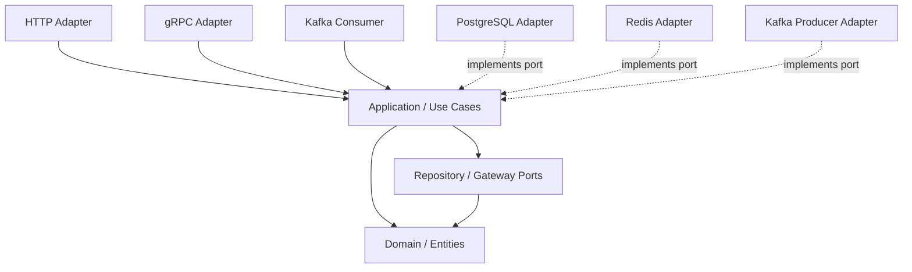

# 00 Software Architecture Foundations

## Tại sao cần học?

Clean Architecture thường bị dạy như một sơ đồ vòng tròn hoặc một cấu trúc folder. Cách học đó làm bạn nhớ tên layer nhưng không hiểu vì sao phải tách chúng. Trước khi nói về Entity, Use Case hay Repository, cần hiểu Software Architecture đang bảo vệ điều gì.

Architecture tồn tại vì phần mềm có nhiều thứ thay đổi với tốc độ khác nhau. Business rules thường là lý do hệ thống tồn tại. Database, HTTP framework, Kafka client, folder structure và cloud SDK là chi tiết phục vụ business rules. Nếu chi tiết thay đổi nhanh kéo theo business rules, hệ thống sẽ ngày càng đắt đỏ để sửa.

## Vấn đề

Một backend ban đầu thường rất đơn giản:

```text
HTTP request
↓
Handler
↓
Query database
↓
Business validation
↓
Return JSON
```

Vấn đề xuất hiện khi logic lớn dần:

- Handler biết quá nhiều về nghiệp vụ.
- SQL query quyết định shape của domain.
- Database transaction nằm rải rác.
- Kafka event được publish ngay giữa business rule.
- Unit test phải khởi động database dù chỉ muốn test một rule.
- Đổi REST sang gRPC làm sửa cả business logic.

Đây không phải lỗi của HTTP, SQL hay Kafka. Đây là lỗi boundary.

## Mental Model

Hãy chia code thành hai nhóm:

```text
Policy  = hệ thống muốn đạt điều gì
Detail  = hệ thống dùng công nghệ gì để đạt điều đó
```

Ví dụ banking:

```text
Policy:
- Tài khoản không được rút vượt overdraft limit.
- Transfer phải debit account A và credit account B một cách nhất quán.
- Một transfer request có idempotency key không được xử lý hai lần.

Detail:
- PostgreSQL lưu account.
- Redis giữ rate limit.
- Kafka publish event.
- HTTP nhận request.
- OpenTelemetry ghi trace.
```

Software Architecture tốt giữ policy độc lập tương đối với detail.

## Khái niệm

### Software Architecture là gì?

Software Architecture là tập các quyết định khó đổi về boundary, dependency, module, data ownership và cách hệ thống đáp ứng quality attributes như maintainability, testability, reliability, scalability.

Architecture không phải chỉ là:

- Dùng microservices.
- Dùng Clean Architecture.
- Chia folder theo mẫu trên Internet.
- Vẽ diagram đẹp.

Architecture là cách bạn trả lời các câu hỏi:

- Module nào được phép biết module nào?
- Business rule nằm ở đâu?
- Thay database có ảnh hưởng vùng nào?
- Một request đi qua transaction boundary nào?
- Khi thêm delivery mechanism mới, core logic có đổi không?

### Architecture khác Design như thế nào?

Design thường gần code hơn: function, struct, interface, algorithm, naming, package API.

Architecture là các boundary và dependency có chi phí thay đổi cao hơn. Ví dụ:

- Chọn package by feature thay vì package by layer là quyết định architecture.
- Tạo boundary giữa application và infrastructure là quyết định architecture.
- Việc một method tên `Withdraw` hay `Debit` là design gần code hơn.

Hai thứ liên quan chặt chẽ. Design xấu có thể phá architecture. Architecture mơ hồ làm design tốt cũng khó sống lâu.

### High-Level Policy

High-level policy là rule ít phụ thuộc công nghệ. Trong banking:

```text
Nếu số dư sau khi rút nhỏ hơn overdraft limit thì reject withdrawal.
```

Rule này đúng dù bạn dùng PostgreSQL, MySQL, DynamoDB, REST, gRPC hay Kafka.

### Low-Level Details

Low-level details là cơ chế:

- `pgxpool.Pool`
- SQL schema.
- Kafka topic.
- Redis key format.
- HTTP route.
- JSON field name.
- Config env var.

Detail quan trọng trong production, nhưng không nên định hình domain.

### Business Rules

Business rules là luật làm hệ thống có giá trị. Có hai nhóm thường gặp:

- Enterprise business rules: thuộc Domain, sống lâu, ít phụ thuộc use case cụ thể.
- Application business rules: orchestration cho một flow cụ thể, ví dụ load A, load B, gọi `Withdraw`, gọi `Deposit`, save trong transaction.

### Separation of Concerns

Mỗi phần code nên có một lý do chính để thay đổi:

- Handler đổi khi API contract đổi.
- Repository đổi khi persistence đổi.
- Use case đổi khi workflow application đổi.
- Domain đổi khi nghiệp vụ đổi.

Nếu một file đổi vì cả API, SQL, business rule và Kafka, file đó đang chứa quá nhiều concern.

### Coupling

Coupling là mức độ một phần code bị ràng buộc với phần khác.

Coupling không xấu tuyệt đối. Use case bắt buộc phải coupling với domain vì nó orchestration domain behavior. Vấn đề là coupling sai hướng:

```text
Domain -> PostgreSQL
Application -> Gin context
Entity -> JSON tag + DB tag + Kafka schema
```

Khi đó detail kéo policy đi theo.

### Cohesion

Cohesion là mức độ các phần trong một module cùng phục vụ một mục đích. Package `account/domain` có cohesion cao nếu nó chỉ chứa `Account`, `Money`, invariant và domain error. Nó có cohesion thấp nếu chứa cả SQL query, HTTP response và Kafka producer.

### Dependency Inversion Principle

Dependency Inversion Principle nói high-level module không nên phụ thuộc trực tiếp vào low-level module. Cả hai nên phụ thuộc vào abstraction phù hợp.

Trong Go, abstraction không nhất thiết là interface lớn. Thường nó là một interface nhỏ do use case cần:

```go
type AccountRepository interface {
	FindByID(ctx context.Context, id domain.AccountID) (*domain.Account, error)
	Save(ctx context.Context, account *domain.Account) error
}
```

PostgreSQL adapter implement interface này. Application không import PostgreSQL adapter.

### Stable Dependencies Principle

Code ổn định hơn nên ít phụ thuộc vào code kém ổn định hơn. Domain thường ổn định hơn framework. Vì vậy domain không nên import framework.

Điểm tinh tế: ổn định không có nghĩa là không bao giờ đổi. Domain vẫn đổi khi nghiệp vụ đổi. Nhưng domain không nên đổi chỉ vì bạn thay router HTTP.

### Boundaries

Boundary là ranh giới có chủ ý. Một boundary tốt có:

- Ngôn ngữ riêng: domain dùng `Account`, `Money`, `Transfer`; HTTP dùng request/response DTO.
- Dependency rõ: outer layer import inner layer.
- Mapping rõ: adapter chuyển DTO/DB row/message thành domain object hoặc command.
- Test strategy rõ: domain test không cần database, adapter test có thể dùng integration.

### Abstraction

Abstraction tốt xuất phát từ nhu cầu bảo vệ boundary. Abstraction xấu xuất phát từ thói quen tạo interface cho mọi thứ.

Hỏi trước khi tạo abstraction:

- Consumer có thực sự cần nhiều implementation không?
- Test có cần fake không?
- Có boundary giữa policy và detail không?
- Interface có nhỏ và dùng ngôn ngữ của consumer không?

## Mô Hình Nền

Clean Architecture thường được mô tả:

```text
Frameworks & Drivers
        ↓
Interface Adapters
        ↓
Application / Use Cases
        ↓
Domain / Entities
```

Mũi tên ở đây là source-code dependency. Nó trả lời câu hỏi: package nào import package nào?

Không nhầm với runtime call direction.

## Compile-Time Dependency vs Runtime Flow

Đây là điểm rất quan trọng.

Runtime flow của transfer money có thể là:

```text
HTTP Handler
    ↓
TransferMoneyUseCase
    ↓
PostgresAccountRepository
    ↓
PostgreSQL
```

Nhưng source-code dependency nên là:

```text
delivery/http       -> application
application         -> domain
infrastructure/pg   -> application
infrastructure/pg   -> domain
cmd/api             -> delivery/http + infrastructure/pg + application
```

Use case gọi method của repository interface. Ở runtime, object thật là PostgreSQL repository. Nhưng application package không import PostgreSQL package. Đó là Dependency Inversion.

```text
Application defines need:

type AccountRepository interface {
    FindByID(...)
    Save(...)
}

PostgreSQL adapter satisfies need:

type AccountRepository struct {
    pool *pgxpool.Pool
}
```

Go không cần keyword `implements`. Nếu method set khớp interface, adapter implement interface.

## Golang Implementation

Một cấu trúc tự nhiên cho module `account`:

```text
internal/account/
├── domain/
│   ├── account.go
│   └── money.go
├── application/
│   ├── ports.go
│   └── transfer_money.go
├── infrastructure/
│   └── postgres/
│       └── account_repository.go
└── delivery/
    └── http/
        └── handler.go
```

Không phải mọi project đều cần cấu trúc này. Nhưng với domain có rule và nhiều adapter, cách này làm boundary dễ nhìn.

Dependency mong muốn:

```text
delivery/http imports application
application imports domain
infrastructure/postgres imports application and domain
domain imports standard library only when thật sự cần
```

`cmd/api/main.go` là Composition Root:

```go
func main() {
	db := openPostgres()
	repo := postgres.NewAccountRepository(db)
	useCase := application.NewTransferMoneyUseCase(repo, txManager)
	handler := httpadapter.NewHandler(useCase)

	http.ListenAndServe(":8080", handler.Routes())
}
```

`main.go` được phép biết mọi detail vì nó là nơi lắp ráp object graph. Điều quan trọng là core package không import ngược ra ngoài.

## Dependency

Một dependency trong architecture có thể là:

- Import dependency: package A import package B.
- Type dependency: struct A chứa type B.
- Semantic dependency: A phải biết rule hoặc assumption của B dù không import.
- Runtime dependency: object A gọi object B khi chương trình chạy.

Clean Architecture chủ yếu kiểm soát source-code dependency. Nhưng semantic dependency cũng nguy hiểm. Ví dụ domain không import HTTP nhưng có error tên `ErrBadRequest`; đây vẫn là transport concept rò vào domain.

## Diagram



Diagram này biểu diễn dependency ở mức source code. Runtime call vẫn có thể đi từ application đến object PostgreSQL thông qua interface.

## Ví Dụ

Anti-pattern thường thấy:

```go
func Transfer(w http.ResponseWriter, r *http.Request) {
	// parse JSON
	// query account rows
	// validate balance
	// update account rows
	// publish Kafka event
	// write HTTP response
}
```

Code này chạy được, nhưng boundary bị trộn:

- HTTP parsing nằm cùng business rule.
- SQL row shape có thể trở thành domain shape.
- Kafka failure khó quyết định rollback hay retry.
- Test business rule phải dựng HTTP request và database.

Một hướng tách:

```text
HTTP Handler:
  parse request
  build TransferMoneyCommand
  call use case
  map error to status code

Use Case:
  load accounts
  call domain methods
  save inside transaction
  publish event through port if needed

Domain:
  Account.Withdraw
  Account.Deposit
  Money invariant

Infrastructure:
  PostgreSQL repository
  Kafka event publisher
```

## Anti-pattern

### Architecture Bằng Folder

Tạo nhiều folder nhưng dependency vẫn sai:

```text
domain imports infrastructure/postgres
usecase accepts *gin.Context
entity has gorm tags and json tags
```

Folder nhìn sạch nhưng architecture vẫn bẩn.

### Interface Everywhere

Mỗi struct đều có interface:

```text
IUserService
UserServiceImpl
IUserRepository
UserRepositoryImpl
```

Trong Go, interface nên xuất hiện khi consumer cần abstraction. Nếu interface chỉ mirror một struct và không bảo vệ boundary nào, nó tạo noise.

### Anemic Domain Model

Entity chỉ có field:

```go
type Account struct {
	Balance int64
}
```

Tất cả rule nằm trong service:

```go
account.Balance -= amount
```

Điều này làm invariant khó bảo vệ. Bất kỳ code nào có pointer đến account đều có thể phá rule.

### Generic Repository Quá Sớm

```go
type Repository[T any] interface {
	Create(ctx context.Context, value T) error
	Update(ctx context.Context, value T) error
	Delete(ctx context.Context, id string) error
}
```

CRUD generic có vẻ đẹp, nhưng domain-rich system thường cần repository theo intent:

```go
FindAccountForUpdate(ctx, id)
SaveTransfer(ctx, transfer)
FindPendingLoanApplications(ctx, limit)
```

Repository nên nói ngôn ngữ domain/use case, không chỉ nói ngôn ngữ table.

## Production Scenario

Trong hệ thống payment, một use case `CapturePayment` có thể cần:

- Load payment aggregate.
- Kiểm tra state transition.
- Gọi external payment gateway.
- Ghi transaction.
- Publish domain event.
- Đảm bảo idempotency.

Clean Architecture giúp bạn đặt các ranh giới:

- Payment state transition thuộc domain.
- Workflow capture thuộc application.
- Stripe/Adyen client thuộc infrastructure.
- HTTP request/response thuộc delivery.
- Outbox/Kafka thuộc infrastructure adapter hoặc application port.

Nhưng Clean Architecture không tự giải quyết:

- Network timeout.
- Gateway trả kết quả ambiguous.
- Exactly-once delivery.
- Distributed transaction.
- Message ordering.

Bạn vẫn cần retry, timeout, idempotency key, outbox, reconciliation và observability.

## Trade-offs

Lợi ích:

- Business rules ít bị framework chi phối.
- Test domain/use case nhẹ hơn.
- Thêm delivery adapter mới ít đụng core.
- Chi phí đổi infrastructure được khoanh vùng.
- Code review dependency direction rõ hơn.

Chi phí:

- Nhiều file/package hơn.
- Cần mapping giữa DTO, DB model và domain.
- Team phải thống nhất boundary.
- Với CRUD nhỏ, abstraction có thể nặng hơn lợi ích.

Architecture luôn là bài toán kinh tế: complexity hiện tại so với complexity abstraction tạo thêm.

## Khi nào nên dùng?

Nên cân nhắc Clean Architecture khi:

- Domain có business rules quan trọng.
- Có nhiều delivery mechanism: HTTP, gRPC, worker, CLI.
- Có nhiều infrastructure: PostgreSQL, Redis, Kafka, external APIs.
- Cần test use case không phụ thuộc database.
- Team nhiều người và module sống lâu.
- Hệ thống có transaction, idempotency, workflow hoặc state transition phức tạp.

## Khi nào không nên dùng?

Không cần áp dụng đầy đủ khi:

- Service CRUD nhỏ, ít rule, tuổi đời ngắn.
- Prototype cần validate thị trường nhanh.
- Team chưa đủ context và abstraction làm chậm delivery.
- Domain đơn giản hơn nhiều so với ceremony bạn định tạo.

Bạn vẫn có thể dùng một vài nguyên tắc: giữ handler mỏng, không để domain import framework, gom config ở composition root.

## Lab

Lab liên quan:

- `labs/lab-01-simple-domain`

Mục tiêu:

- Tạo `Account` và `Money`.
- Đưa rule withdraw/deposit vào domain method.
- Viết domain test không cần mock, database hoặc HTTP.

## Bài tập

Chọn một API backend bạn từng làm và trả lời:

1. Business rule chính là gì?
2. File nào đang chứa HTTP detail?
3. File nào đang chứa database detail?
4. Rule nào sẽ khó test nếu không chạy database?
5. Nếu đổi REST sang gRPC, package nào phải sửa?
6. Nếu đổi PostgreSQL sang MySQL, package nào phải sửa?
7. Có interface nào đang tồn tại chỉ vì thói quen không?

## Mastery Check

- [ ] Tôi phân biệt được Software Architecture và Design.
- [ ] Tôi giải thích được high-level policy và low-level detail.
- [ ] Tôi biết dependency trong Clean Architecture chủ yếu là source-code dependency.
- [ ] Tôi không nhầm runtime call direction với import direction.
- [ ] Tôi biết vì sao domain không nên phụ thuộc PostgreSQL, HTTP, Kafka, Redis.
- [ ] Tôi biết Clean Architecture không phải folder structure.
- [ ] Tôi biết khi nào abstraction là chi phí không đáng trả.

## Tổng kết

Software Architecture là cách quản lý thay đổi. Clean Architecture là một tập nguyên tắc giúp business rules đứng độc lập hơn trước framework và infrastructure. Trong Go, áp dụng tốt nghĩa là dùng package, interface nhỏ, constructor injection và composition root một cách tự nhiên. Không cần biến Go thành Java, cũng không cần tạo 20 folder để chứng minh mình đang làm architecture.
