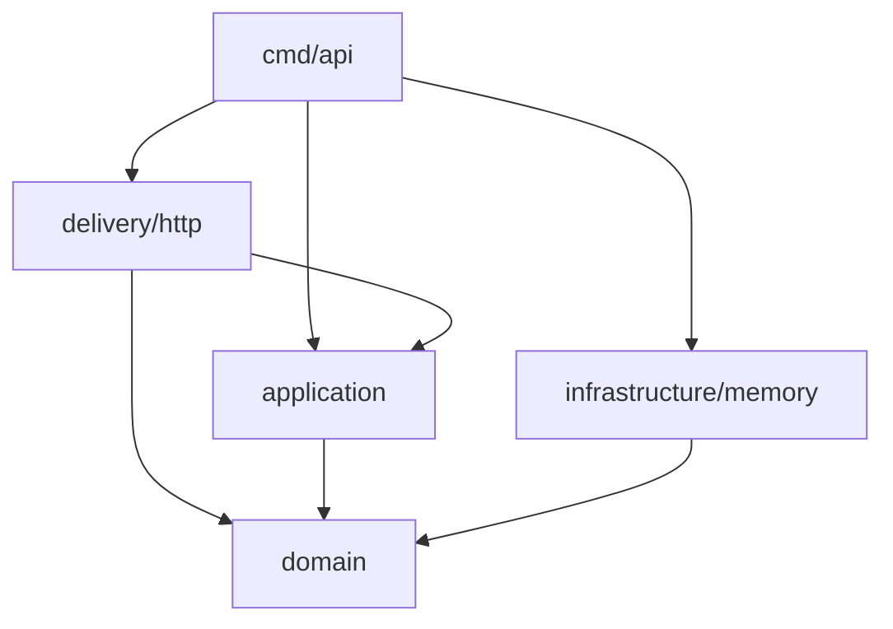
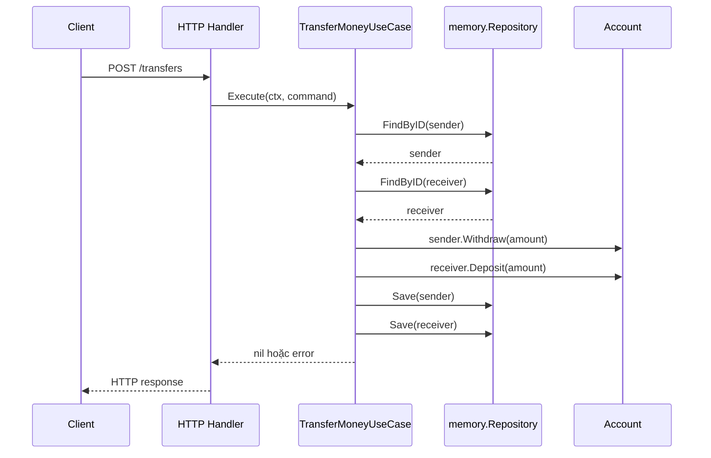

# 01 Clean Architecture Foundations

> Mục tiêu của chapter không phải là nhớ bốn vòng tròn. Sau khi học xong, bạn phải nhìn một flow backend, chỉ ra policy nào cần bảo vệ, detail nào đang rò vào core, boundary nào đáng tạo và abstraction nào nên bỏ.

## Kết Quả Học Tập

Sau chapter này, bạn có thể:

- Giải thích Clean Architecture bằng **boundary và dependency direction**, không bằng folder tree.
- Phân biệt Domain policy, Application policy, adapter và framework/driver.
- Đọc riêng runtime call graph và compile-time import graph của một chương trình Go.
- Thiết kế một incoming adapter và một outgoing port nhỏ theo nhu cầu use case.
- Giải thích vì sao PostgreSQL object có thể được use case gọi ở runtime dù application không import PostgreSQL package.
- Phân tích data đi qua boundary mà không mặc định tạo ba struct cho mọi trường hợp.
- Nhận ra Clean Architecture đang giảm coupling hay chỉ thêm ceremony.
- Điều tra một thay đổi production để xác định boundary nào đã bị phá.

## 1. Problem: Một Handler Chạy Được Nhưng Không Còn Rẻ Để Thay Đổi

Hãy bắt đầu từ một API transfer money. Phiên bản đầu có thể trông hợp lý: một endpoint, một transaction, vài câu SQL và một Kafka message.

Đoạn sau là **conceptual snippet**, cố ý rút gọn để nhìn responsibility; nó không phải production code hoàn chỉnh:

```go
func (h *Handler) Transfer(w http.ResponseWriter, r *http.Request) {
	var req struct {
		FromID string `json:"from_account_id"`
		ToID   string `json:"to_account_id"`
		Amount int64  `json:"amount"`
	}
	if err := json.NewDecoder(r.Body).Decode(&req); err != nil {
		http.Error(w, "bad request", http.StatusBadRequest)
		return
	}

	tx, err := h.pool.Begin(r.Context())
	if err != nil {
		http.Error(w, "database unavailable", http.StatusServiceUnavailable)
		return
	}
	defer tx.Rollback(r.Context())

	fromBalance := loadBalance(r.Context(), tx, req.FromID)
	if fromBalance-req.Amount < 0 {
		http.Error(w, "insufficient balance", http.StatusConflict)
		return
	}

	updateBalance(r.Context(), tx, req.FromID, -req.Amount)
	updateBalance(r.Context(), tx, req.ToID, req.Amount)
	h.kafka.WriteMessages(r.Context(), kafka.Message{Value: []byte("transferred")})

	if err := tx.Commit(r.Context()); err != nil {
		http.Error(w, "commit failed", http.StatusInternalServerError)
		return
	}
	w.WriteHeader(http.StatusCreated)
}
```

Vấn đề không phải function dài. Vấn đề là các quyết định có **lý do thay đổi khác nhau** bị khóa cùng nhau:

| Quyết định | Lý do thay đổi |
|---|---|
| JSON field và HTTP status | API contract đổi |
| SQL và `pgx.Tx` | Schema/driver/persistence strategy đổi |
| Không cho số dư âm | Business policy đổi |
| Thứ tự debit/credit | Application workflow đổi |
| Kafka payload/topic | Integration contract đổi |
| Timeout/retry/log | Operational policy đổi |

Khi sáu lý do thay đổi cùng nằm trong một handler, mọi thay đổi đều có blast radius lớn:

```text
Đổi HTTP contract
        ↓
chạm function chứa SQL và transaction
        ↓
reviewer phải kiểm tra lại business rule và publish flow
        ↓
rủi ro regression tăng dù nghiệp vụ không đổi
```

Thêm gRPC còn tệ hơn. Nếu copy function, business rule có hai nguồn sự thật. Nếu gọi HTTP handler từ gRPC, transport này bị coupling vào transport kia. Nếu tách một `TransferService` nhưng service vẫn nhận `*gin.Context`, `*pgxpool.Pool` và Kafka writer, ta chỉ chuyển God Handler thành God Service.

Đó là bài toán Clean Architecture muốn xử lý: **đặt boundary theo lý do thay đổi và làm source dependency hướng về policy**.

## 2. Ba Level Để Hiểu Clean Architecture

### Level 1: Trực Giác

Hãy xem business rules là lõi của sản phẩm. HTTP, PostgreSQL, Kafka và framework là các thiết bị cắm vào lõi.

```text
HTTP ──┐
CLI ───┼──> APPLICATION + DOMAIN <── PostgreSQL
Kafka ─┘                              Redis
```

Nếu thay thiết bị mà phải viết lại rule cốt lõi, boundary chưa làm việc.

Trực giác quan trọng:

- **Inside** là policy ít phụ thuộc công nghệ hơn.
- **Outside** là mechanism cụ thể hơn.
- Inside không đồng nghĩa “code quan trọng”, outside không đồng nghĩa “code đơn giản”. Một PostgreSQL adapter xử lý lock có thể rất khó, nhưng nó vẫn là detail đối với rule `không được rút quá overdraft limit`.

### Level 2: Backend Engineer

Ở mức code, Clean Architecture ảnh hưởng đến package API:

```text
delivery/http         imports application
application           imports domain
infrastructure/memory imports domain
cmd/api               imports và lắp tất cả concrete types
```

Use case nhận capability qua interface:

```go
type AccountRepository interface {
	FindByID(ctx context.Context, id domain.AccountID) (*domain.Account, error)
	Save(ctx context.Context, account *domain.Account) error
}
```

Infrastructure cung cấp concrete implementation. Go dùng implicit interface satisfaction nên adapter không cần khai báo `implements`.

### Level 3: Architecture Reasoning

Boundary là quyết định về **ownership**:

- Application sở hữu câu hỏi “tôi cần capability nào để thực hiện transfer?”.
- PostgreSQL adapter sở hữu câu hỏi “capability đó được thực hiện bằng SQL/pgx thế nào?”.
- HTTP adapter sở hữu câu hỏi “request/response public trông ra sao?”.
- Domain sở hữu invariant “state nào là hợp lệ?”.

Dependency direction đi theo ownership của policy, không nhất thiết đi theo control flow.

Nếu application phải import type của PostgreSQL để mô tả nhu cầu, low-level detail đang sở hữu contract của high-level policy. Dependency Inversion đảo quyền sở hữu đó: application định nghĩa contract tối thiểu, adapter phụ thuộc contract để cung cấp implementation.

## 3. Clean Architecture Thực Sự Hứa Điều Gì?

Clean Architecture hướng tới các thuộc tính sau:

- Business rules có thể chạy/test mà không cần UI, database hay web server.
- Framework là công cụ, không phải nơi sở hữu application policy.
- Database được thay hoặc nâng cấp mà thay đổi chủ yếu nằm ở adapter và composition root.
- Delivery mechanism mới tái sử dụng use case thay vì copy nghiệp vụ.
- Boundary buộc data được chuyển đổi có chủ ý thay vì để external schema lan xuyên hệ thống.

Đây là **mục tiêu thiết kế**, không phải bảo đảm tự động. Chia folder đúng tên nhưng import sai vẫn thất bại. Dùng interface khắp nơi nhưng interface mang type `pgx.Row` vẫn thất bại. Domain không import HTTP nhưng trả `ErrHTTPConflict` vẫn bị semantic coupling với HTTP.

Clean Architecture cũng không tự giải quyết:

- Deadlock, lost update hoặc isolation anomaly.
- Kafka duplicate, ordering và consumer rebalance.
- Network timeout, ambiguous result và distributed transaction.
- Query performance, indexing và capacity planning.
- Chọn đúng aggregate hoặc đúng service boundary.

Nó giúp **đặt những giải pháp đó đúng chỗ**, không thay thế chúng.

## 4. Policy Và Detail Không Phải Hai Folder

### Domain Policy

Domain policy mô tả trạng thái và hành vi có ý nghĩa nghiệp vụ:

```text
balance sau withdrawal phải >= -overdraftLimit
amount phải dương
không cộng Money khác currency
```

Trong mini-banking, rule nằm trong `Account.Withdraw` và `Money`:

```go
func (a *Account) Withdraw(amount Money) error {
	if !amount.IsPositive() {
		return ErrInvalidAmount
	}

	next, err := a.balance.Sub(amount)
	if err != nil {
		return err
	}

	tooLow, err := next.LessThan(a.overdraftLimit.Negate())
	if err != nil {
		return err
	}
	if tooLow {
		return ErrInsufficientBalance
	}

	a.balance = next
	return nil
}
```

Rule này không cần biết request đến từ HTTP hay Kafka, account được load từ PostgreSQL hay memory.

### Application Policy

Application policy mô tả một actor/system đạt mục tiêu bằng workflow nào:

```text
TransferMoney:
1. hiểu command
2. load sender và receiver
3. áp dụng domain behavior
4. lưu thay đổi trong một atomic boundary
```

`TransferMoney` không phải rule của riêng một `Account`: nó orchestration hai account và persistence boundary.

### Detail

Detail là lựa chọn cụ thể:

- Route `POST /transfers`.
- JSON dùng `snake_case`.
- SQL dùng `SELECT ... FOR UPDATE`.
- Driver là `pgx`.
- Event được publish lên Kafka topic nào.
- Trace được ghi bằng OpenTelemetry SDK nào.

Detail có thể rất quan trọng cho reliability. Gọi nó là detail không có nghĩa được phép làm qua loa; nghĩa là core policy không nên bị shape bởi implementation cụ thể đó.

## 5. Bốn Vùng Trách Nhiệm, Không Phải Bốn Folder Bắt Buộc

Sơ đồ phổ biến:

```text
Frameworks & Drivers
        ↓
Interface Adapters
        ↓
Application / Use Cases
        ↓
Domain / Entities
```

Mũi tên là source-code dependency hướng vào policy. Bốn vùng diễn tả responsibility:

| Vùng | Sở hữu | Ví dụ banking |
|---|---|---|
| Domain / Entities | Invariant, state transition, domain language | `Account`, `Money`, `ErrInsufficientBalance` |
| Application / Use Cases | Workflow theo actor, port cần dùng, transaction/idempotency policy | `TransferMoneyUseCase`, `AccountRepository`, `Transactor` |
| Interface Adapters | Mapping giữa protocol/storage schema và core model | HTTP handler, PostgreSQL mapper, Kafka consumer |
| Frameworks & Drivers | Runtime/library/device cụ thể | `net/http`, pgx, PostgreSQL, Kafka broker |

Một project nhỏ không nhất thiết có bốn package. `internal/todo` có thể chứa handler/service/store trong một package mà vẫn giữ responsibility đủ rõ cho quy mô đó. Ngược lại, project có 20 folder vẫn có thể vi phạm Dependency Rule.

### Clean, Hexagonal Và Onion

Ba trường phái có vocabulary khác nhau nhưng chia sẻ mục tiêu lớn:

| Cách gọi | Trọng tâm hữu ích |
|---|---|
| Clean Architecture | Dependency hướng về business rules; phân biệt policy và mechanism |
| Hexagonal Architecture / Ports and Adapters | Application giao tiếp với outside qua ports; nhiều adapter có thể cắm vào cùng port |
| Onion Architecture | Domain model ở lõi; dependency hướng vào trong qua các vòng |

Không cần tranh luận `repository` thuộc vòng ba hay vòng bốn trước khi biết nó phục vụ policy nào. Câu hỏi có giá trị hơn là: **ai sở hữu contract, package nào import package nào, và data ngoại vi dừng ở đâu?**

## 6. Ports Và Adapters

### Incoming Port

Incoming port mô tả application cho phép actor làm gì. Trong Go, nó có thể chỉ là method concrete, không bắt buộc là interface:

```go
type TransferMoneyUseCase struct {
	accounts AccountRepository
	tx       Transactor
}

func (uc *TransferMoneyUseCase) Execute(
	ctx context.Context,
	cmd TransferMoneyCommand,
) error {
	// orchestration
	return nil
}
```

HTTP handler có thể nhận một interface nhỏ vì **handler là consumer** và cần fake use case trong transport test:

```go
type TransferUseCase interface {
	Execute(context.Context, application.TransferMoneyCommand) error
}
```

Không cần tạo `ITransferMoneyUseCase` trong application chỉ để có “port đúng mẫu”. Concrete use case đã là API hợp lệ; interface xuất hiện ở adapter nơi có nhu cầu thay thế.

### Incoming Adapter

Incoming adapter biến protocol input thành application input:

```text
HTTP JSON                  Application Command
---------------------     ---------------------------
from_account_id       ->  FromAccountID
to_account_id         ->  ToAccountID
amount                ->  Amount
currency              ->  Currency
```

Handler chịu trách nhiệm:

1. Giới hạn và decode body.
2. Kiểm tra syntax/shape của transport.
3. Map DTO sang command.
4. Truyền request context vào use case.
5. Map result/error sang HTTP response.

Nó không quyết định số dư có đủ không.

### Outgoing Port

Outgoing port diễn đạt capability application cần từ outside:

```go
type AccountRepository interface {
	FindByID(ctx context.Context, id domain.AccountID) (*domain.Account, error)
	Save(ctx context.Context, account *domain.Account) error
}
```

Tên và type của port dùng language của consumer. Port không nên trả `pgx.Row`, nhận `*sql.Tx` hoặc expose Redis key.

### Outgoing Adapter

Adapter dùng technology cụ thể để thực hiện port:

```go
type Repository struct {
	accounts map[domain.AccountID]*domain.Account
}

func (r *Repository) FindByID(
	ctx context.Context,
	id domain.AccountID,
) (*domain.Account, error) {
	// memory implementation
}
```

Sau này `postgres.Repository` có thể dùng `*pgxpool.Pool`. Concrete field đó nằm trong adapter nên không kéo pgx vào application.

## 7. Một Vertical Slice Bằng Go

Full example compile được nằm tại [`examples/mini-banking`](../examples/mini-banking/README.md). Hãy đọc theo thứ tự sau:

1. [`domain/money.go`](../examples/mini-banking/internal/account/domain/money.go): Value Object và currency rule.
2. [`domain/account.go`](../examples/mini-banking/internal/account/domain/account.go): Entity và overdraft invariant.
3. [`application/ports.go`](../examples/mini-banking/internal/account/application/ports.go): outgoing capability application cần.
4. [`application/transfer_money.go`](../examples/mini-banking/internal/account/application/transfer_money.go): workflow của use case.
5. [`infrastructure/memory/repository.go`](../examples/mini-banking/internal/account/infrastructure/memory/repository.go): adapter.
6. [`delivery/http/handler.go`](../examples/mini-banking/internal/account/delivery/http/handler.go): incoming adapter.
7. [`cmd/api/main.go`](../examples/mini-banking/cmd/api/main.go): Composition Root.

Chạy:

```bash
cd examples/mini-banking
go test ./...
go run ./cmd/api
```

Gửi request:

```bash
curl -i -X POST http://localhost:8080/transfers \
  -H 'Content-Type: application/json' \
  -d '{"from_account_id":"A-100","to_account_id":"B-200","amount":500000,"currency":"VND"}'
```

### Composition Root

`main.go` tạo object graph:

```go
repo := memory.NewRepository(seedAccounts...)
transferMoney := application.NewTransferMoneyUseCase(
	repo,
	application.NoopTransactor{},
)
handler := httpadapter.NewHandler(transferMoney)
```

`main` được phép import application, delivery và infrastructure vì trách nhiệm của nó chính là chọn concrete implementation và quản lý lifecycle. Đây không phải chỗ chứa business rule.

### Compile-time Dependency



Điều đáng chú ý: memory adapter không cần import application chỉ để khai báo rằng nó implement `AccountRepository`. Implicit satisfaction của Go cho phép composition root đưa `*memory.Repository` vào constructor và compiler kiểm tra method set.

### Runtime Flow



Runtime arrow `UC -> Repo` không tạo import `application -> infrastructure/memory`. Variable trong use case có static type `AccountRepository`; concrete value được inject từ `main`.

## 8. Dependency Analysis: Năm Loại Coupling Cần Nhìn

Chỉ kiểm import chưa đủ. Khi review boundary, hãy xem ít nhất năm loại dependency:

### 8.1 Import Dependency

Go làm loại dependency này rất rõ:

```go
import "github.com/acme/bank/internal/account/domain"
```

Package chứa import phụ thuộc package được import. Go cấm import cycle, nhưng compiler không biết dependency nào vi phạm policy kiến trúc của team.

### 8.2 Type Dependency

Code không import package adapter vẫn có thể bị detail shape chi phối nếu type đi xuyên boundary:

```go
type TransferCommand struct {
	Row pgx.Row
}
```

Application command đã phụ thuộc persistence type. Đây vừa là import vừa là type dependency.

### 8.3 Data Dependency

Một struct có thể chỉ dùng built-in type nhưng vẫn mang schema ngoại vi:

```go
type Account struct {
	BalanceNumericText string
	DeletedAtValid     bool
}
```

Không có import pgx, nhưng domain bị shape bởi cách database biểu diễn `NUMERIC` và nullable column.

### 8.4 Semantic Dependency

```go
var ErrHTTPConflict = errors.New("http conflict")
```

Domain chỉ import `errors`, nhưng biết HTTP semantics. Nếu gRPC gọi cùng use case, tên error trở nên sai ngữ cảnh. Coupling tồn tại trong meaning, không chỉ trong compiler graph.

### 8.5 Ownership Dependency

Một interface 20 method đặt ở package infrastructure rồi bắt application dùng có thể khiến provider sở hữu contract. Khi provider thêm method cho consumer khác, mọi fake của application phải đổi.

Consumer-defined interface là heuristic mạnh trong Go vì nó giữ contract tối thiểu theo nhu cầu. Nhưng không phải luật tuyệt đối: một domain-level abstraction ổn định và dùng chung có thể thuộc domain package; một public library có thể hợp lý khi producer công bố interface.

## 9. Data Đi Qua Boundary

Clean Architecture không yêu cầu mọi endpoint có đúng ba struct `Request`, `Domain`, `Row`.

### Khi Tách Là Có Giá Trị

Ví dụ ba model thay đổi vì ba lý do khác nhau:

```go
// HTTP contract
type transferRequest struct {
	FromAccountID string `json:"from_account_id"`
	Amount        int64  `json:"amount"`
}

// Application input
type TransferMoneyCommand struct {
	FromAccountID string
	Amount        int64
	Currency      string
}

// Persistence shape, nằm trong postgres adapter
type accountRow struct {
	ID             string
	BalanceMinor   int64
	Currency       string
	Version        int64
	UpdatedAt      time.Time
}
```

Tách giúp:

- HTTP rename field không chạm domain.
- Database thêm `version` không buộc API expose field.
- Domain dùng `Money` thay primitive pair `amount/currency`.
- Kafka schema có version riêng.

### Khi Reuse Là Hợp Lý

Một internal CRUD tool nhỏ có model gần như giống nhau và tuổi đời ngắn có thể dùng chung struct. Mapping ba lớp cho bốn field không tự động tạo giá trị.

Hãy hỏi:

1. Các shape có lý do thay đổi khác nhau không?
2. Domain có invariant/behavior cần bảo vệ không?
3. External contract có cần version độc lập không?
4. Chi phí mapping có nhỏ hơn chi phí coupling dự kiến không?

Boundary là quyết định kinh tế, không phải nghi thức.

## 10. Wrong Example Và Hậu Quả

### 10.1 Application Nhận Framework Context

```go
func (uc *TransferMoneyUseCase) Execute(c *gin.Context) error {
	fromID := c.Param("account_id")
	// ...
}
```

Chuỗi hậu quả:

```text
Application import Gin
        ↓
use case input bị đồng nhất với HTTP request
        ↓
Kafka consumer/gRPC phải dựng hoặc né Gin context
        ↓
application test phụ thuộc framework behavior
        ↓
transport detail sở hữu application API
```

Correct direction:

```go
func (uc *TransferMoneyUseCase) Execute(
	ctx context.Context,
	cmd TransferMoneyCommand,
) error
```

`context.Context` truyền cancellation/deadline qua I/O boundary; command mang application data. Domain method `Account.Withdraw(amount)` không cần context vì phép kiểm tra invariant không phụ thuộc request lifecycle.

### 10.2 Domain Import ORM

```go
type Account struct {
	ID      string `gorm:"primaryKey" json:"id"`
	Balance int64  `gorm:"column:balance" json:"balance"`
}
```

Không phải mọi tag đều lập tức gây thảm họa. Với CRUD nhỏ, đây có thể là trade-off chấp nhận được. Nhưng trong domain-rich banking:

```text
Persistence/API annotations nằm trên domain
        ↓
field phải exported cho mapper/framework
        ↓
caller có thể sửa Balance trực tiếp
        ↓
invariant không còn được bảo vệ ở một cửa
        ↓
database/API shape bắt đầu quyết định domain model
```

### 10.3 Interface Mirror Implementation

```go
type IAccountService interface {
	Transfer(context.Context, TransferRequest) error
}

type AccountServiceImpl struct { /* ... */ }
```

Tên `I...` và `...Impl` không làm dependency được inverted. Hỏi ai là consumer và abstraction bảo vệ gì. Nếu chỉ `main` tạo service và handler có thể nhận concrete type, interface ở producer có thể là ceremony. Nếu handler test cần fake capability, đặt interface nhỏ tại handler package.

## 11. Testing Strategy Chứng Minh Boundary

Boundary chỉ có giá trị khi test cho thấy core chạy độc lập và adapter được kiểm tra đúng chỗ.

| Test | Dependency thật | Điều cần chứng minh |
|---|---|---|
| Domain unit test | Không mock, không DB | Invariant và state transition |
| Use case test | Fake repository/transactor | Orchestration, error propagation, save behavior |
| HTTP adapter test | Fake incoming port | Decode/map/status contract |
| Repository integration test | PostgreSQL thật | Query, schema, mapping, constraint, transaction |
| End-to-end test | Full wiring chọn lọc | Composition và critical journey |

Ví dụ domain test trong project:

```go
func TestAccountWithdrawProtectsOverdraftInvariant(t *testing.T) {
	account := newTestAccount(t, "A-100", 100_000, 50_000, "VND")
	amount := MustMoney(200_000, "VND")

	err := account.Withdraw(amount)

	if !errors.Is(err, ErrInsufficientBalance) {
		t.Fatalf("expected ErrInsufficientBalance, got %v", err)
	}
}
```

Test này không nhanh vì ta “mock giỏi”; nó nhanh vì policy không phụ thuộc I/O.

Một repository mock không chứng minh SQL đúng. Boundary cho phép ta chọn test phù hợp: core dùng unit/fake test, adapter SQL dùng integration test với PostgreSQL semantics thật.

## 12. Production Scenario: Transfer 5.000 TPS

Giả sử hệ thống có:

- 5.000 transfer/giây.
- Một số account là hot key.
- Client retry khi timeout.
- PostgreSQL thỉnh thoảng failover.
- Kafka chậm hoặc unavailable.
- Response có thể mất sau khi DB commit.

Phân chia responsibility:

| Vấn đề | Boundary sở hữu quyết định chính |
|---|---|
| `balance >= -overdraftLimit` | Domain `Account` |
| Load A/B, debit/credit, tạo transfer | Application use case |
| Row lock, isolation, SQL retryable code | PostgreSQL adapter + application retry policy |
| Duplicate idempotency key | Application policy + DB unique constraint |
| Kafka down sau DB write | Outbox workflow + publisher adapter |
| HTTP timeout/response mapping | HTTP adapter/server config |
| Trace xuyên request/DB/Kafka | Delivery/infrastructure instrumentation, context propagation |

Điểm quan trọng: boundary không chia hệ thống thành những hộp không giao tiếp. Nó cho biết **quyết định thuộc về ai** và **dependency nào được phép**.

### Failure 1: Commit Thành Công, Response Bị Mất

Client thấy timeout và retry. Nếu use case không có idempotency, transfer có thể chạy lần hai. Transaction chỉ bảo vệ một lần execution; nó không biết hai request có cùng business intent.

Clean boundary cho phép application nhận `IdempotencyKey`, repository adapter enforce unique constraint và HTTP adapter chuyển header thành command. Nhưng chính design idempotency mới giải quyết failure.

### Failure 2: PostgreSQL Down

Domain rule không đổi. PostgreSQL adapter trả error có cause; application phân loại outcome nếu cần; HTTP adapter map thành response public. Không trả raw driver message cho client.

### Failure 3: Kafka Down

Không giữ DB transaction mở để chờ network call tùy ý. Với guarantee “DB state và event intent cùng tồn tại”, transaction ghi account, transfer và outbox row; publisher xử lý outbox sau. Chapter Kafka/Transaction sẽ triển khai sâu pattern này.

### Failure 4: Hai Request Cùng Rút Tiền

Hai domain object riêng đều có thể pass invariant dựa trên snapshot cũ. Domain model đúng là cần thiết nhưng chưa đủ; adapter phải dùng row lock hoặc optimistic version, transaction boundary phải đúng. Đây là ví dụ rõ nhất cho việc Clean Architecture không thay thế concurrency control.

## 13. Debug Và Investigation Workflow

Khi một thay đổi “nhỏ” kéo theo nhiều package, đừng sửa ngay. Điều tra boundary:

### Bước 1: Vẽ Runtime Path

Ví dụ incident “transfer trả 500 khi Kafka timeout”:

```text
HTTP -> use case -> repository -> DB -> publisher -> Kafka
```

Runtime path cho biết request đã đi đâu, chưa nói dependency đúng hay sai.

### Bước 2: Vẽ Import Graph

Trong Go:

```bash
go list -deps ./...
go list -f '{{.ImportPath}} -> {{join .Imports ", "}}' ./...
```

Tìm các edge như `application -> pgx`, `domain -> net/http`, `domain -> kafka client`.

### Bước 3: Theo Dõi Type Và Data Shape

Tìm driver/framework type trong core:

```bash
rg 'pgx|sql\.Tx|http\.Request|gin\.Context|kafka\.' internal/account/domain internal/account/application
```

Sau đó tìm semantic leak như `HTTPStatus`, `TopicName`, `TableName`, `RedisKey` dù không có import.

### Bước 4: Xác Định Owner Của Quyết Định

Hỏi:

- Retry Kafka là application policy hay adapter policy?
- “Transfer đã accepted” được định nghĩa bởi DB commit hay Kafka ack?
- API có được trả success trước khi event publish không?

Không thể đặt boundary đúng nếu semantics chưa rõ.

### Bước 5: Viết Test Ở Boundary Cần Bảo Vệ

- Nếu bug là balance rule: domain test.
- Nếu bug là save thứ hai fail: use case/transaction integration test.
- Nếu bug là status code: HTTP adapter test.
- Nếu bug là SQL lock: PostgreSQL concurrency integration test.

Investigation này tránh “sửa” incident bằng cách thêm retry ở mọi layer.

## 14. Trade-offs

### Giá Trị

- Policy dễ đọc vì vocabulary không bị framework lấn át.
- Test core rẻ và tập trung vào behavior.
- Technology migration có blast radius rõ hơn.
- Nhiều delivery adapter tái sử dụng application flow.
- Ownership giúp team review và phát triển song song.

### Chi Phí

- Mapping code và nhiều package hơn.
- Interface/constructor làm object graph dài hơn.
- Debug runtime cần hiểu cả abstraction lẫn concrete implementation.
- Boundary sai tạo indirection mà không giảm coupling.
- Team phải duy trì contract và vocabulary nhất quán.

### Khi Nào Không Nên Dùng Đầy Đủ?

Không cần bốn vùng/package cho mọi API. Một Todo CRUD nhỏ, một admin tool nội bộ hoặc prototype ngắn hạn có thể dùng:

```text
internal/todo/
  handler.go
  service.go
  store.go
```

Vẫn có thể giữ vài nguyên tắc có lợi:

- Handler không nuốt toàn bộ workflow.
- SQL không rải qua nhiều endpoint.
- Business transition có method/test riêng khi bắt đầu xuất hiện.
- Không tạo interface cho đến khi có consumer cần abstraction hoặc boundary đáng bảo vệ.

### Tín Hiệu Nên Đầu Tư Boundary

- Cùng business rule được gọi từ HTTP, Kafka và batch.
- Workflow chạm nhiều repository/gateway.
- Domain có invariant/state transition gây tổn thất nếu sai.
- Infrastructure thay đổi hoặc failure policy phức tạp.
- Team lớn lên và ownership mơ hồ.
- Core test đang buộc khởi động database/framework.

Clean Architecture nên tiến hóa cùng pressure thật của hệ thống.

## 15. Bài Tập Thực Hành

### Bài 1: Đọc Mini-banking

Không mở đáp án riêng. Hãy tự lập hai bảng:

1. Runtime edge: caller thực sự gọi object nào?
2. Import edge: package nào import package nào?

Giải thích vì sao `TransferMoneyUseCase` gọi `memory.Repository` ở runtime nhưng không import package memory.

### Bài 2: Thêm CLI Adapter

Viết một `cmd/transfer` nhận `from`, `to`, `amount`, `currency` từ flag và gọi cùng `TransferMoneyUseCase`.

Ràng buộc:

- Không sửa domain để biết CLI.
- Không truyền `flag.FlagSet` vào application.
- CLI map error sang exit code ở adapter.

Sau đó so sánh phần code reuse với cách copy logic từ HTTP handler.

### Bài 3: Boundary Cost

Thiết kế hai phiên bản Todo API:

- Phiên bản A: `handler/service/store` trong một feature package.
- Phiên bản B: domain/application/ports/adapters tách đầy đủ.

Với team 3 người, 4 endpoint CRUD, tuổi đời 3 tháng, hãy chọn một phiên bản và ghi rõ chi phí bạn chấp nhận. Thêm rule “Completed Todo không được đổi due date”, rồi đánh giá lại.

### Bài 4: Failure Ownership

Với transfer flow, trả lời ai sở hữu quyết định cho từng failure:

- JSON malformed.
- Insufficient balance.
- Account row không tồn tại.
- PostgreSQL serialization failure.
- Kafka publish timeout.
- Client retry cùng idempotency key.

Không dùng câu trả lời “infrastructure xử lý hết”. Ghi policy, mechanism và boundary phối hợp.

## 16. Mastery Questions

Không nhìn lại chapter khi trả lời lần đầu:

1. Clean Architecture bảo vệ điều gì nếu database không bao giờ được thay?
2. Vì sao runtime call `UseCase -> PostgresRepository` không chứng minh source dependency sai?
3. Một interface đặt trong infrastructure nhưng chỉ chứa domain type có luôn sai không? Ownership nào cần xem?
4. Nếu domain không import `net/http` nhưng có field `HTTPStatus`, dependency nào đang rò?
5. Vì sao `Account.Withdraw(ctx, amount)` thường là dấu hiệu sai, còn `Repository.FindByID(ctx, id)` hợp lý?
6. Khi nào dùng chung DTO và DB model là trade-off chấp nhận được?
7. Vì sao domain test pass vẫn không ngăn double spending?
8. Outbox thuộc “vòng” nào? Vì sao câu hỏi về responsibility hữu ích hơn tên vòng?
9. Một service chỉ CRUD có cần repository interface không? Dữ kiện nào làm câu trả lời thay đổi?
10. Nếu đổi Kafka library làm application test fail compile, boundary nào có khả năng đã bị phá?

Bạn đạt mastery khi câu trả lời có chuỗi nguyên nhân, trade-off và context, không chỉ lặp “dependency phải hướng vào trong”.

## 17. Further Reading

- [The Clean Architecture - Robert C. Martin](https://blog.cleancoder.com/uncle-bob/2012/08/13/the-clean-architecture.html): nguồn trình bày các đặc tính độc lập với framework, UI và database cùng Dependency Rule. Đọc để hiểu origin, không dùng diagram như template folder.
- [Hexagonal Architecture - Alistair Cockburn](https://alistair.cockburn.us/hexagonal-architecture/): bài gốc về application ở inside, ports và nhiều adapters. So sánh vocabulary với Clean Architecture.
- [The Go Programming Language Specification - Packages and imports](https://go.dev/ref/spec#Packages): nền tảng chính xác để hiểu import declaration tạo compile-time dependency và import cycle bị cấm.
- [The Go Programming Language Specification - Interface types](https://go.dev/ref/spec#Interface_types): cách Go xác định implicit interface implementation.
- [Go Code Review Comments](https://go.dev/wiki/CodeReviewComments): conventions thực dụng khi viết Go; dùng để giữ implementation idiomatic thay vì bê nguyên phong cách từ ngôn ngữ khác.

Các nguồn trên không hoàn toàn dùng cùng terminology. Điểm chung đáng giữ là tách policy khỏi device/framework và kiểm soát dependency. Cấu trúc package cụ thể phải được quyết định theo domain, team và chi phí thay đổi của hệ thống đang xây.

## 18. Quality Gate Của Chapter

- [x] Problem và chuỗi WHY.
- [x] Mental model ở ba level.
- [x] Core theory và so sánh Clean/Hexagonal/Onion.
- [x] Go implementation idiomatic và link tới full example.
- [x] Wrong/correct examples có consequence analysis.
- [x] Runtime flow và compile-time dependency tách riêng.
- [x] Import, type, data, semantic và ownership dependency.
- [x] Trade-off và khi nào không nên áp dụng đầy đủ.
- [x] Production/failure scenarios.
- [x] Debug/investigation workflow.
- [x] Testing strategy.
- [x] Exercises và mastery questions.
- [x] Further Reading có chú giải.

Chapter này giải thích nền tảng. Guarantee transaction, concurrency, PostgreSQL và outbox mới chỉ được định vị, chưa được triển khai ở đây; chúng thuộc các chapter chuyên biệt và evolution sau của mini-banking.
