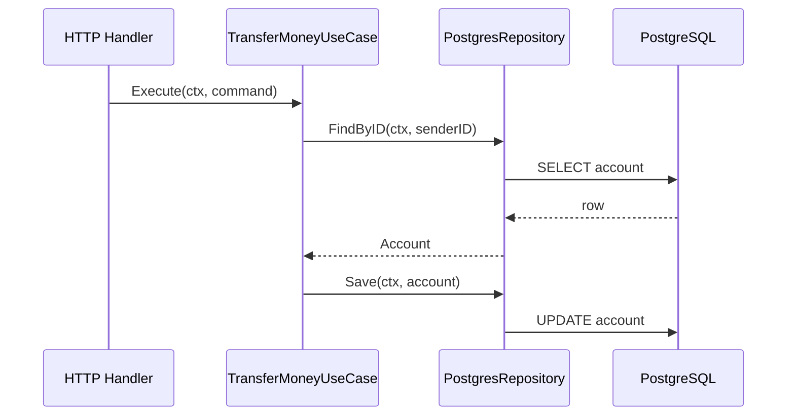
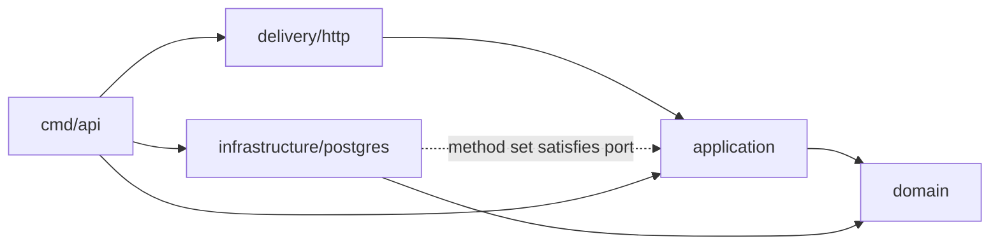

# 02 Dependency Rule

> Dependency Rule không nói “mọi lời gọi phải đi vào trong”. Nó nói source code chứa policy không được phụ thuộc vào tên, type và assumption của detail ở phía ngoài. Runtime control flow vẫn có thể đi từ use case ra PostgreSQL, Kafka hoặc external API thông qua một contract do policy phù hợp sở hữu.

## Kết Quả Học Tập

Sau chapter này, bạn có thể:

- Phân biệt runtime call, compile-time import, type, data, semantic và ownership dependency.
- Đọc Go import graph để kiểm tra Dependency Rule thay vì đoán từ folder.
- Giải thích Dependency Inversion ở mức source code và object runtime.
- Đặt interface theo consumer trong trường hợp phù hợp, đồng thời nhận ra các ngoại lệ hợp lý.
- Giữ `pgx`, `net/http`, Kafka client và Redis client khỏi application/domain mà không tạo interface vô nghĩa.
- Phân tích `context.Context` nên đi qua boundary nào và vì sao domain behavior thường không cần context.
- Viết architecture fitness test để chặn một số import sai tự động.
- Đánh giá khi nào vi phạm có chủ đích rẻ hơn một abstraction.

## 1. Problem: Dependency Sai Không Chỉ Là Import Cycle

Go compiler cấm cycle:

```text
package account imports package postgres
package postgres imports package account
```

Nhưng graph sau compile hoàn toàn bình thường:

```text
delivery/http -> application -> infrastructure/postgres -> pgx
```

Vấn đề là application policy phụ thuộc concrete persistence detail. Hãy xem một use case:

```go
type TransferMoneyUseCase struct {
	pool *pgxpool.Pool
}

func (uc *TransferMoneyUseCase) Execute(
	ctx context.Context,
	cmd TransferMoneyCommand,
) error {
	tx, err := uc.pool.Begin(ctx)
	// query, scan, rule, update, commit...
	return err
}
```

Code có thể ngắn và chạy đúng hôm nay. Nhưng dependency tạo ra chuỗi thay đổi:

```text
Application import pgx
        ↓
use case biết transaction API và row scanning của PostgreSQL
        ↓
workflow bị trộn với persistence mechanism
        ↓
test transfer phải fake driver behavior hoặc chạy DB
        ↓
đổi locking/query strategy chạm application policy
        ↓
review business change phải review cả SQL lifecycle
```

Ngay cả khi không bao giờ đổi PostgreSQL, boundary vẫn có giá trị: business workflow và persistence failure có test strategy, vocabulary và lý do thay đổi khác nhau.

Dependency Rule không yêu cầu xóa mọi coupling. Application **nên** coupling với domain. HTTP adapter **nên** coupling với application contract. Mục tiêu là dependency đi theo chiều ổn định của policy và ownership.

## 2. Ba Level Để Hiểu Dependency Rule

### Level 1: Trực Giác

Code business nói nó **cần gì**, code technical nói **làm bằng cách nào**.

```text
Application: "Tôi cần tìm và lưu Account"
PostgreSQL:   "Tôi thực hiện bằng SELECT/UPDATE qua pgx"
```

Nếu application phải nói “tôi cần `*pgxpool.Pool`”, câu mô tả nhu cầu đã bị detail chiếm lấy.

### Level 2: Backend Engineer

Application định nghĩa interface nhỏ:

```go
type AccountRepository interface {
	FindByID(ctx context.Context, id domain.AccountID) (*domain.Account, error)
	Save(ctx context.Context, account *domain.Account) error
}
```

Adapter có method set tương ứng:

```go
type PostgresRepository struct {
	pool *pgxpool.Pool
}

func (r *PostgresRepository) FindByID(
	ctx context.Context,
	id domain.AccountID,
) (*domain.Account, error) {
	// SQL, scan và mapping nằm tại đây.
}
```

`main.go` inject concrete adapter vào use case. Go compiler kiểm tra `*PostgresRepository` thỏa interface tại assignment/call site.

### Level 3: Architecture Reasoning

Dependency Inversion không chỉ đổi concrete type thành interface. Nó đảo **ownership của contract**:

```text
Trước:
application phụ thuộc API do PostgreSQL driver sở hữu

Sau:
application sở hữu capability contract
PostgreSQL adapter phụ thuộc language của application/domain
```

Nếu interface vẫn trả `pgx.Row` hoặc nhận `pgx.Tx`, ownership chưa thực sự đảo. Tên interface ở application nhưng contract vẫn bị driver shape.

## 3. Rule Chính Xác

Một cách phát biểu thực dụng:

> Source-code dependency chỉ nên hướng từ mechanism cụ thể hơn tới policy trừu tượng/ổn định hơn. Code ở inner boundary không nên biết tên, type, schema hoặc semantics chỉ tồn tại ở outer boundary.

Từ “inner/outer” là quan hệ, không phải tọa độ folder tuyệt đối:

- `domain` thường bên trong `application` vì use case dùng domain policy.
- `application` thường bên trong HTTP/PostgreSQL/Kafka adapters.
- `main` ở ngoài cùng vì nó biết concrete implementations để lắp object graph.
- Một shared domain kernel có thể bên trong nhiều feature, nhưng coupling đó phải được quản lý rất cẩn thận.

Rule này chủ yếu nói về source code, nhưng review tốt phải nhìn thêm data và semantics vì compiler không bắt được tất cả.

## 4. Runtime Flow Khác Compile-time Dependency

### Runtime Flow

Một transfer chạy như sau:



Use case gọi repository object thật. Không có chuyện “application không được gọi infrastructure ở runtime”. Nếu cấm runtime call đó, application không thể thực hiện I/O.

### Compile-time Graph

Source graph mong muốn:



Application source chỉ gọi method trên static type `AccountRepository`. Dynamic value lúc runtime là `*PostgresRepository`.

Đây là điểm mấu chốt:

```text
runtime receiver concrete: *postgres.PostgresRepository
compile-time field type:    application.AccountRepository
```

## 5. Go Làm Dependency Inversion Như Thế Nào?

### 5.1 Interface Satisfaction Là Implicit

Go không có keyword `implements`. Một type thỏa interface khi method set phù hợp. Điều này cho phép consumer định nghĩa interface sau khi producer đã tồn tại.

Application:

```go
type AccountRepository interface {
	FindByID(context.Context, domain.AccountID) (*domain.Account, error)
	Save(context.Context, *domain.Account) error
}
```

Memory adapter hiện tại chỉ import domain:

```go
type Repository struct {
	accounts map[domain.AccountID]*domain.Account
}
```

Composition root:

```go
repo := memory.NewRepository(accounts...)
uc := application.NewTransferMoneyUseCase(repo, tx)
```

Compiler kiểm tra `repo` ở constructor call. Adapter không bắt buộc import application.

### 5.2 Compile-time Assertion Là Lựa Chọn, Không Phải Luật

Adapter có thể ghi:

```go
var _ application.AccountRepository = (*PostgresRepository)(nil)
```

Ưu điểm: adapter fail compile ngay khi contract đổi, và intent dễ thấy. Chi phí: adapter phải import application dù method signatures vốn đã đủ. Cả hai lựa chọn đều giữ dependency đúng hướng vì outer adapter phụ thuộc inner application.

### 5.3 Constructor Injection Tạo Runtime Link

```go
func NewTransferMoneyUseCase(
	accounts AccountRepository,
	tx Transactor,
) *TransferMoneyUseCase {
	return &TransferMoneyUseCase{accounts: accounts, tx: tx}
}
```

Constructor không tự đảo dependency. Giá trị của nó là làm dependency explicit, ngăn service tự gọi global registry hoặc tự mở connection, và cho composition root quyền chọn adapter.

## 6. Interface Nên Nằm Ở Đâu?

Không có một package name đúng cho mọi interface. Hãy xác định **consumer, language và lý do thay đổi**.

### 6.1 Interface Thuộc Application

`TransferMoneyUseCase` cần load/save account. Interface có đúng hai method phục vụ workflow:

```go
package application

type AccountRepository interface {
	FindByID(ctx context.Context, id domain.AccountID) (*domain.Account, error)
	Save(ctx context.Context, account *domain.Account) error
}
```

Đặt gần application hợp lý vì:

- Application là consumer trực tiếp.
- Method set thay đổi khi nhu cầu use case đổi.
- Fake trong application test chỉ cần implement đúng capability này.
- Infrastructure không áp contract CRUD rộng của nó lên core.

### 6.2 Interface Thuộc Domain

Một abstraction có thể thuộc domain nếu chính capability là domain concept, dùng domain language và không xuất phát từ orchestration/persistence detail. Ví dụ policy thuần:

```go
type ExchangeRateProvider interface {
	Rate(from Currency, to Currency, at time.Time) (Rate, error)
}
```

Tuy nhiên có `context.Context` và remote failure thường cho thấy việc lấy rate là application/outgoing concern. Domain có thể nhận `Rate` đã được lấy thay vì tự gọi provider. Quyết định phụ thuộc việc “rate policy” là pure domain calculation hay external capability.

### 6.3 Interface Thuộc Delivery Adapter

HTTP handler là consumer của incoming use case:

```go
package httpadapter

type TransferUseCase interface {
	Execute(context.Context, application.TransferMoneyCommand) error
}
```

Application không cần tự công bố interface cho concrete use case. Handler định nghĩa đúng method nó gọi; test handler dùng spy/fake dễ dàng.

### 6.4 Interface Do Producer Công Bố

Không phải lúc nào consumer-defined interface cũng thắng. Public library có nhiều implementation được thiết kế như một family, plugin API hoặc stable protocol abstraction có thể công bố interface từ producer package.

Ví dụ standard library `database/sql/driver` sở hữu contracts mà database drivers implement. Đây là deliberate extension point, không phải interface mirror một struct tùy ý.

### 6.5 Không Cần Interface

Nếu một use case chỉ dùng pure calculator, không có I/O boundary và test có thể dùng concrete type, nhận struct trực tiếp thường rõ hơn:

```go
type FeeCalculator struct {
	rate BasisPoints
}

func NewTransferMoney(fees FeeCalculator) *TransferMoneyUseCase
```

“Có một implementation” không tự động nghĩa là không cần interface. Repository vẫn có một production implementation nhưng interface bảo vệ policy khỏi driver và cho fake test. Ngược lại, “có thể có hai implementation trong tương lai” không đủ để tạo interface hôm nay.

### Decision Table

| Tình huống | Vị trí thường hợp lý | Lý do |
|---|---|---|
| Use case cần persistence/gateway capability | Application, gần consumer | Contract theo workflow |
| Handler cần gọi use case | Delivery adapter | Handler là consumer |
| Pure business policy thật sự độc lập orchestration | Domain | Domain sở hữu language/rule |
| Public extension point có nhiều provider | Producer/public package | Producer chủ động quản lý protocol |
| Concrete helper không cần thay thế | Không interface | Tránh indirection không có lợi ích |

## 7. Package Dependency Trong Mini-banking

Structure hiện tại:

```text
internal/
├── account/
│   ├── domain/
│   ├── application/
│   ├── delivery/http/
│   └── infrastructure/memory/
└── architecture/
```

Các edge production:

| From | To | Đánh giá | Vì sao |
|---|---|---|---|
| `application` | `domain` | OK | Workflow dùng domain policy |
| `delivery/http` | `application` | OK | Adapter gọi incoming use case |
| `delivery/http` | `domain` | Chấp nhận trong context này | Adapter map domain error; sau này có thể map qua application error taxonomy |
| `infrastructure/memory` | `domain` | OK | Adapter rehydrate/store aggregate |
| `cmd/api` | mọi concrete package | OK | Composition Root lắp object graph |
| `domain` | `application` | Wrong | Domain bị use-case workflow chi phối |
| `domain` | `delivery/http` | Wrong | Business policy biết transport |
| `application` | `infrastructure/memory` | Wrong | Policy chọn concrete adapter |

Kiểm tra graph:

```bash
cd examples/mini-banking
go list -f '{{.ImportPath}} -> {{join .Imports ", "}}' ./...
```

Folder name không có quyền lực đặc biệt. Nếu package `domain` import `infrastructure/postgres`, compiler vẫn build miễn không cycle. Dependency Rule là policy cần test/review riêng.

## 8. Sáu Dạng Dependency Cần Review

### 8.1 Import Dependency

Theo Go specification, import declaration tạo quan hệ dependency giữa package importing và imported. Đây là edge dễ tự động kiểm tra nhất.

```go
import "github.com/jackc/pgx/v5/pgxpool"
```

Nếu edge nằm trong application, cần hỏi pgx đang phục vụ policy nào và có nên bị đẩy ra adapter không.

### 8.2 Type Dependency

```go
func (uc *TransferMoneyUseCase) Execute(ctx *gin.Context) error
```

Application API không thể dùng nếu không có Gin type. Test và adapter khác bị kéo theo framework.

### 8.3 Data Dependency

```go
type Account struct {
	BalanceText string
	DeletedAt   sql.NullTime
}
```

Domain bị shape bởi serialization/persistence representation. Đổi column type hoặc null strategy buộc đổi business model.

### 8.4 Semantic Dependency

```go
var ErrStatus409 = errors.New("conflict")
```

Không import HTTP nhưng domain hiểu transport status. Đây là leak về meaning.

### 8.5 Temporal Dependency

```text
caller phải gọi Begin()
rồi SaveSender()
rồi SaveReceiver()
rồi Commit()
```

Các method có thể nằm sau interface sạch nhưng caller phải biết protocol nội bộ dễ dùng sai. Closure-based transaction hoặc aggregate operation có thể gom temporal contract, đổi lại thêm abstraction.

### 8.6 Operational Dependency

Application có thể không import Kafka client nhưng vẫn giả định `Publish` luôn hoàn thành dưới 10 ms hoặc exactly-once. Assumption không được ghi/test sẽ trở thành coupling production.

Dependency Rule cần đi cùng explicit semantics: timeout, idempotency, ordering và atomicity guarantee.

## 9. Data Qua Boundary: Không Truyền Row Đi Xuyên Core

Wrong:

```go
type AccountRepository interface {
	FindByID(ctx context.Context, id string) (pgx.Row, error)
}
```

Interface nằm trong application nhưng:

- Application phải import pgx.
- Row scanning responsibility không rõ.
- Database schema/type encoding rò vào use case.
- Fake phải giả lập driver abstraction thay vì domain behavior.

Correct trong domain-rich flow:

```go
type AccountRepository interface {
	FindByID(ctx context.Context, id domain.AccountID) (*domain.Account, error)
}
```

PostgreSQL adapter map:

```text
PostgreSQL row
    ↓ scan
accountRow
    ↓ validate/rehydrate
domain.Account
```

Mapping có chi phí. Với read-only query, không nhất thiết ép qua aggregate:

```go
type AccountBalanceReader interface {
	GetBalance(ctx context.Context, id string) (BalanceView, error)
}
```

Query port có thể trả application read model tối ưu, trong khi command side dùng aggregate. Dependency Rule bảo vệ ownership; nó không bắt mọi data phải đi qua Entity.

## 10. `context.Context` Qua Boundary

Context mang deadline, cancellation và request-scoped values cần thiết cho I/O call chain:

```text
HTTP request context
        ↓
Application Execute(ctx, command)
        ↓
Repository/Gateway methods(ctx, ...)
        ↓
PostgreSQL/HTTP/Kafka client
```

Đây là dependency vào standard protocol của Go, không phải HTTP framework cụ thể.

Domain behavior thường không cần context:

```go
func (a *Account) Withdraw(amount Money) error
```

Nếu method là pure in-memory rule, cancellation không có ý nghĩa. Thêm context vào mọi method làm request lifecycle rò vào model và che dấu việc domain đang gọi I/O.

Ngoại lệ có chủ đích tồn tại: computation domain rất nặng có thể cần cancellation. Khi đó hãy ghi rõ vì sao context là computational control, không phải đường vận chuyển logger/tracer/DB transaction tùy ý.

Không dùng context như service locator:

```go
// Wrong: dependency bị giấu, không type-safe ở constructor.
repo := ctx.Value(repositoryKey).(AccountRepository)
```

Context value phù hợp với metadata xuyên request như trace ID hoặc auth claims đã chuẩn hóa, không phù hợp để thay Dependency Injection.

## 11. Wrong Examples Và Chuỗi Hậu Quả

### 11.1 Domain Import PostgreSQL

```go
func (a *Account) Save(ctx context.Context, tx pgx.Tx) error
```

```text
Entity import pgx
    ↓
state transition và persistence lifecycle nằm cùng API
    ↓
domain test phải dựng technical dependency
    ↓
aggregate không thể tồn tại độc lập persistence
    ↓
business model bị driver/version change tác động
```

Correct: entity chỉ thay đổi state hợp lệ; repository adapter lưu state.

### 11.2 Application Khởi Tạo Concrete Adapter

```go
func NewTransferMoney(pool *pgxpool.Pool) *TransferMoneyUseCase {
	repo := postgres.NewAccountRepository(pool)
	return &TransferMoneyUseCase{accounts: repo}
}
```

Application chọn mechanism và import adapter. Hãy chuyển việc chọn implementation ra composition root.

### 11.3 Provider-owned God Interface

```go
type Repository interface {
	CreateAccount(...)
	UpdateAccount(...)
	DeleteAccount(...)
	ListAccounts(...)
	SaveLoan(...)
	SaveTransfer(...)
	Health(...)
}
```

Mọi consumer/fake phụ thuộc method không dùng. Interface đổi theo database adapter thay vì theo capability của use case. Tách theo consumer hoặc bounded context, không nhất thiết “mỗi method một interface”.

### 11.4 Port Leak Transaction Type

```go
type AccountRepository interface {
	Save(ctx context.Context, tx pgx.Tx, account *domain.Account) error
}
```

Application sở hữu interface nhưng vẫn phụ thuộc pgx. Các lựa chọn tốt hơn gồm closure `WithinTransaction`, explicit Unit of Work do application sở hữu, hoặc tx-aware repository interface không expose driver type. Chapter Transaction sẽ so sánh đầy đủ.

### 11.5 Domain Error Chứa Transport Meaning

```go
type DomainError struct {
	Status int
	Code   string
}
```

Nếu `Status` chỉ là HTTP status, gRPC/Kafka consumer bị buộc hiểu một transport khác. Domain nên diễn đạt `ErrInsufficientBalance`; HTTP adapter quyết định 409, gRPC adapter quyết định code tương ứng.

### 11.6 Shared Package Che Mất Ownership

```text
internal/shared/models
internal/shared/interfaces
internal/shared/utils
```

Đẩy type vào `shared` không làm nó trung lập. Package thường trở thành điểm mọi module cùng sửa, coupling lan ngang và ownership biến mất. Chỉ share concept có semantics thật sự chung và ổn định; còn lại giữ gần consumer/feature.

## 12. Architecture Fitness Test

Mini-banking có test tại [`internal/architecture/dependency_test.go`](../examples/mini-banking/internal/architecture/dependency_test.go). Test dùng `go/parser` để đọc import declarations của production files:

```go
func TestCorePackagesDoNotDependOnOuterLayers(t *testing.T) {
	// domain: chỉ standard library
	// application: standard library + account/domain
}
```

Chạy:

```bash
cd examples/mini-banking
go test ./internal/architecture -v
```

Test cố ý bỏ qua `_test.go`: test code có thể dùng outer fake/integration harness mà không tạo production import edge.

### Test Bắt Được Gì?

- Domain import project package/third-party library.
- Application import third-party driver/framework.
- Application import delivery/infrastructure package trong module.

### Test Không Bắt Được Gì?

- Semantic leak như `HTTPStatus` dùng built-in `int`.
- Data shape bị database điều khiển nhưng không dùng driver type.
- Interface quá lớn hoặc sai ownership.
- Runtime guarantee sai như save không atomic.
- Dependency qua code generation/build tags không nằm trong path được scan.

Fitness test là guardrail, không thay architecture reasoning/code review. Rule quá cứng cũng có thể cản một ngoại lệ hợp lý; khi sửa rule, PR phải giải thích policy thay đổi chứ không chỉ làm test xanh.

## 13. Production Scenarios

### Scenario A: Thêm PostgreSQL Cho Memory Example

Mong muốn:

```text
thêm infrastructure/postgres
đổi wiring ở cmd/api
thêm integration tests
```

Không mong muốn:

```text
sửa Account.Withdraw
sửa HTTP request DTO
sửa TransferMoneyCommand chỉ vì row có created_at
```

Nhưng “đổi database không sửa core” không phải lời hứa tuyệt đối. Nếu consistency semantics đổi, ví dụ từ PostgreSQL transaction sang eventually consistent store, application workflow có thể phải đổi vì capability thực sự khác. Boundary làm khác biệt lộ rõ thay vì giả vờ hai database tương đương.

### Scenario B: Transfer Cần Row Lock

Application cần semantics “hai account được load trong một consistency boundary”. PostgreSQL thực hiện bằng `SELECT ... FOR UPDATE` và thứ tự lock ổn định để giảm deadlock.

Port có thể là:

```go
FindByIDForUpdate(ctx context.Context, id domain.AccountID) (*domain.Account, error)
```

Tên này lộ concurrency intent nhưng không lộ SQL type. Một lựa chọn khác là Unit of Work cung cấp tx-scoped repositories. Không có một API đúng cho mọi hệ thống; điều cần bảo vệ là application không thao tác `pgx.Tx`, domain không biết lock, và semantics atomicity được test.

### Scenario C: Kafka Publisher Đổi Library

Nếu application port là:

```go
type TransferEvents interface {
	PublishTransferred(ctx context.Context, event MoneyTransferred) error
}
```

đổi Sarama sang kafka-go chủ yếu chạm adapter. Nếu port nhận `sarama.ProducerMessage`, library đã sở hữu application contract và migration lan vào core/test.

### Scenario D: Request Timeout Sau Commit

Context bị cancel không có nghĩa transaction chắc chắn rollback; commit có thể đã thành công nhưng response mất. Dependency direction đúng không giải quyết ambiguity. Application cần idempotency policy, adapter cần unique constraint và transport cần trả/retrieve result ổn định.

Đây là operational dependency: caller có thể retry. Contract use case phải thiết kế với reality đó.

## 14. Transaction Boundary Và Dependency Rule

Transfer chạm sender, receiver và transfer record:

```text
BEGIN
load sender
load receiver
withdraw/deposit
save sender
save receiver
insert transfer
COMMIT
```

Repository riêng lẻ không biết toàn bộ atomic operation. Application có workflow context nên thường quyết định boundary; infrastructure implement transaction mechanism.

Một port tối thiểu:

```go
type Transactor interface {
	WithinTransaction(
		ctx context.Context,
		fn func(context.Context) error,
	) error
}
```

Trade-off của context-based transaction:

- Signature repository không cần `tx` parameter.
- Closure làm boundary dễ thấy.
- Concrete transaction bị giấu trong context, dễ bị misuse như service locator.
- Repository phải biết cách lấy transaction handle từ context.
- Nested transaction semantics cần định nghĩa rõ.

Dependency Rule chỉ nói application không phụ thuộc `pgx.Tx`; nó không chọn pattern thay bạn. Clarity, atomicity, testability và team convention quyết định pattern.

## 15. Testing Strategy

### Domain Test

Không cần repository mock. Nếu domain test import pgx hoặc HTTP, đó là tín hiệu dependency sai hoặc test đang ở sai layer.

### Use Case Test

Fake implement interface consumer cần:

```go
type fakeAccounts struct {
	accounts map[domain.AccountID]*domain.Account
}

func (f *fakeAccounts) FindByID(
	ctx context.Context,
	id domain.AccountID,
) (*domain.Account, error) {
	return f.accounts[id].Clone(), nil
}
```

Test behavior và outcome, không khóa cứng mọi call sequence nếu sequence không phải requirement.

### Adapter Integration Test

PostgreSQL adapter cần database thật/container để chứng minh SQL, mapping, constraint và locking. Mock driver chỉ chứng minh code gửi string mong đợi, không chứng minh PostgreSQL thực thi đúng.

### Architecture Test

Fitness test kiểm import policy. Nó nên nhanh và chạy trong `go test ./...`, nhưng không thay review semantics.

## 16. Debug Và Investigation

Khi nghi Dependency Rule bị phá:

### Bước 1: Liệt Kê Direct Imports

```bash
go list -f '{{.ImportPath}} -> {{join .Imports ", "}}' ./...
```

Không chỉ dùng `go list -deps`, vì transitive dependency của domain qua standard library không có cùng ý nghĩa với direct import do code domain viết.

### Bước 2: Tìm Technology Type Trong Core

```bash
rg 'pgx|sql\.Tx|http\.Request|gin\.Context|sarama|redis' internal/account/domain internal/account/application
```

### Bước 3: Theo Data Từ Adapter Vào Core

Từ handler/request hoặc repository/row, theo type qua function signature. Nếu external DTO sống xuyên đến entity, ghi lại field nào tồn tại chỉ vì schema ngoại vi.

### Bước 4: Kiểm Interface Ownership

Với mỗi interface:

1. Consumer nào gọi nó?
2. Method nào consumer không dùng?
3. Type nào thuộc provider detail?
4. Ai phải sửa khi implementation thêm capability?
5. Bỏ interface đi thì boundary/test nào mất?

### Bước 5: Kiểm Failure Semantics

Một API type sạch vẫn có thể có contract mơ hồ. Hỏi timeout có retry được không, operation có idempotent không, save có atomic không, event có at-least-once không.

## 17. Trade-offs Và Ngoại Lệ Có Chủ Đích

### Lợi Ích

- Business change ít kéo theo technology code.
- Test core không cần dựng I/O.
- Contract nhỏ phản ánh đúng nhu cầu use case.
- Infrastructure migration và parallel development dễ khoanh vùng.
- Import graph trở thành tài liệu có thể kiểm chứng.

### Chi Phí

- Thêm mapping, constructors và một số interfaces.
- Developer phải lần từ interface tới concrete adapter khi debug.
- Sai abstraction làm API khó hiểu hơn concrete code.
- Fitness rule có thể quá cứng khi architecture tiến hóa.

### Khi Nào Application Import `database/sql` Có Thể Chấp Nhận?

Một command-line migration tool, reporting job thuần SQL, tiny CRUD service hoặc prototype có thể ưu tiên directness. Nếu code không có business policy đáng bảo vệ và tuổi đời ngắn, thêm repository/mapper chỉ để “đúng Clean” có thể lãng phí.

Quyết định có chủ đích nên ghi:

- Scope và lifetime.
- Loại test cần có.
- Điều kiện nào sẽ kích hoạt việc tách boundary.
- Detail nào được chấp nhận coupling.

Không gọi mọi import `database/sql` trong application là bug. Trong domain-rich, long-lived workflow, nó thường là smell mạnh cần giải thích.

### Đừng Abstract Theo Vendor Khi Capability Khác Nhau

PostgreSQL transaction và eventually consistent key-value store không có cùng guarantee. Một `GenericRepository[T]` che cả hai có thể tạo abstraction giả. Port phải diễn đạt capability application thực sự cần, kể cả consistency semantics.

## 18. Bài Tập

### Bài 1: Dự Đoán Compiler Graph

Trước khi chạy `go list`, tự viết direct imports cho từng package mini-banking. Sau đó so sánh output và giải thích edge nào thuộc test code nhưng không thuộc production code.

### Bài 2: Làm Fitness Test Fail

Tạm thêm import `net/http` vào domain production file và dùng một identifier để compiler không báo unused. Chạy:

```bash
go test ./internal/architecture -v
```

Giải thích vì sao test fail. Sau đó revert thay đổi thử nghiệm bằng cách sửa file thủ công, không dùng destructive Git command.

### Bài 3: Thiết Kế Port Cho Locking

Đề xuất ba API:

- `FindByIDForUpdate`.
- `WithinTransaction(ctx, fn)` với context-based repository.
- Unit of Work truyền tx-scoped repository vào closure.

So sánh clarity, transaction leakage, testability và nested transaction behavior.

### Bài 4: Tìm Semantic Leak

Đoạn sau không import transport package:

```go
type Error struct {
	Code       string
	HTTPStatus int
	RetryAfter int
}
```

Phân loại field nào có thể thuộc application taxonomy, field nào thuộc HTTP adapter và dữ kiện nào làm câu trả lời thay đổi.

### Bài 5: Không Dùng Interface

Chọn một concrete dependency trong service bạn từng làm. Viết lập luận vì sao nó không cần interface. Sau đó nêu một thay đổi requirement cụ thể khiến quyết định đó cần xem lại.

## 19. Mastery Questions

1. Dependency Rule điều khiển runtime call hay source dependency? Minh họa bằng repository.
2. Tại sao chuyển `*pgxpool.Pool` thành interface `DB` ngay trong application chưa chắc đã invert dependency?
3. Interface application trả `pgx.Row` vi phạm loại dependency nào?
4. Vì sao interface thường đặt gần consumer trong Go, và khi nào producer-owned interface hợp lý?
5. Memory adapter hiện tại không import application. Compiler kiểm tra nó thỏa port ở đâu?
6. Domain import standard library có luôn hợp lệ không? Cho semantic counter-example.
7. `context.Context` nên đi từ HTTP tới repository, nhưng vì sao thường dừng trước Entity method?
8. Nếu dùng DynamoDB khiến workflow transaction phải đổi, điều đó có chứng minh boundary thất bại không?
9. Architecture fitness test bắt được gì và bỏ sót gì?
10. Khi nào direct SQL trong một service là trade-off hợp lý?
11. Vì sao repository port theo capability có thể tốt hơn generic CRUD interface?
12. Dependency đúng hướng có đảm bảo save sender/receiver atomic không? Cần thêm gì?

Một câu trả lời tốt phải nói được owner, source edge, runtime object, semantics và trade-off trong context cụ thể.

## 20. Further Reading

- [The Clean Architecture - Robert C. Martin](https://blog.cleancoder.com/uncle-bob/2012/08/13/the-clean-architecture.html): đọc phần Dependency Rule để đối chiếu “tên từ outer circle không được xuất hiện ở inner circle”. Áp dụng theo source dependency, không biến vòng tròn thành folder mandate.
- [Hexagonal Architecture - Alistair Cockburn](https://alistair.cockburn.us/hexagonal-architecture/): nguồn gốc Ports and Adapters và mục tiêu chạy application tách khỏi UI/database.
- [Go Specification: Import declarations](https://go.dev/ref/spec#Import_declarations): định nghĩa chính thức rằng import declaration tạo dependency relation giữa package.
- [Go Specification: Interface types](https://go.dev/ref/spec#Interface_types): method sets/type sets và implicit implementation.
- [A Tour of Go: Interfaces are implemented implicitly](https://go.dev/tour/methods/10): ví dụ ngắn để hiểu producer không cần khai báo implements.
- [Go package `context`](https://pkg.go.dev/context): contract chính thức về deadline, cancellation và request-scoped values qua API boundaries.

Các nguồn architecture có vocabulary khác nhau. Chapter dùng “port” cho contract ở boundary và dùng “Dependency Rule” cho source direction; code Go vẫn ưu tiên interface nhỏ, package cohesion và explicit composition.

## 21. Quality Gate Của Chapter

- [x] Problem và chuỗi WHY từ direct pgx dependency.
- [x] Mental model ở ba level.
- [x] Runtime và compile-time graph riêng.
- [x] Go interface satisfaction, constructor injection và composition root.
- [x] Interface location có nhiều lựa chọn, không dạy rule tuyệt đối.
- [x] Import/type/data/semantic/temporal/operational dependency.
- [x] Wrong/correct examples và consequence analysis.
- [x] Context boundary.
- [x] Transaction/locking scenario và trade-off.
- [x] Production failure scenarios.
- [x] Testing và debug workflow.
- [x] Runnable architecture fitness test.
- [x] Exercises, mastery questions và Further Reading.
- [x] Mục “khi nào không nên abstract”.

Chapter này hoàn thành Dependency Rule ở mức nền tảng production. Thiết kế repository, transaction và database adapter cụ thể sẽ được đào sâu ở chapter 05, 10 và 11; Dependency Rule ở đây là tiêu chuẩn để review các implementation đó.
