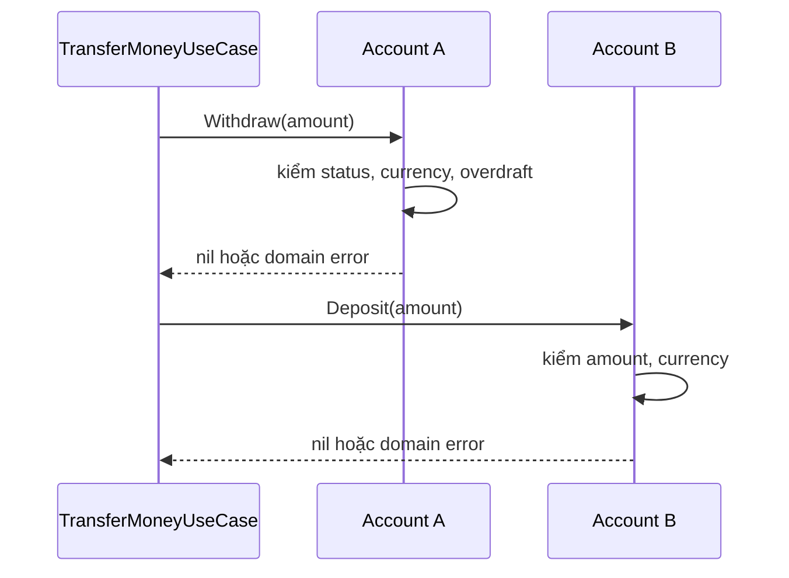
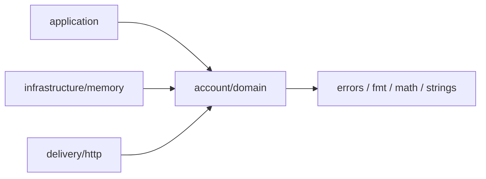

# 03 Domain Layer

> Domain Layer không phải folder chứa các struct giống table. Nó là nơi model biểu diễn identity, value, valid state và state transition bằng ngôn ngữ nghiệp vụ. Một domain model tốt làm đường sai khó đi hơn và giữ rule đúng ngay cả khi caller là HTTP, Kafka, batch hay test.

Chapter này được tách thành nhiều bài vì Entity, Value Object, Invariant và Aggregate là các quyết định khác nhau. Mỗi file là material có thể học độc lập, không phải outline.

## Kết Quả Học Tập

Sau chapter này, bạn có thể:

- Phân biệt Entity bằng identity và continuity, không bằng việc struct có field `ID`.
- Thiết kế Value Object có equality theo value, validation và immutable-style API trong Go.
- Phân biệt transport validation với domain invariant.
- Chọn Aggregate theo consistency boundary thay vì gom các struct “có liên quan”.
- Đặt business behavior vào Entity, Value Object hoặc Domain Service bằng reasoning rõ ràng.
- Phân biệt Domain Event với Kafka message/integration event.
- Thiết kế constructor/factory/rehydration path không tạo invalid state.
- Dùng domain error để mô tả business outcome mà không gắn HTTP status.
- Test domain không cần mock và biết giới hạn của domain test trước concurrency/database failure.
- Nhận ra khi rich domain model có giá trị và khi procedural service đơn giản hơn.

## Learning Path

Đọc theo thứ tự:

1. [Entity và Identity](./01-entity.md): object nào cần continuity qua thời gian.
2. [Value Object và Equality](./02-value-object.md): dùng type để mang domain meaning và giảm primitive obsession.
3. [Invariant và Valid State](./03-invariant.md): constructor, private fields và state transition bảo vệ rule thế nào.
4. [Aggregate và Consistency Boundary](./04-aggregate.md): transaction/concurrency bắt đầu ảnh hưởng model ở đâu.
5. [Domain Service](./05-domain-service.md): rule thuần domain không thuộc tự nhiên về một Entity.
6. [Domain Event](./06-domain-event.md): ghi nhận fact trong domain và tách khỏi Kafka contract.
7. [Modeling Walkthrough](./07-modeling-example.md): đi từ requirement transfer đến model/code đang chạy.
8. [Anti-patterns](./08-anti-patterns.md): anemic model, setter, ORM entity, aggregate quá lớn và abstraction thừa.
9. [Exercises](./exercises.md): bài tập không kèm đáp án trong cùng file.

Full implementation dùng xuyên chapter nằm tại [`examples/mini-banking/internal/account/domain`](../examples/mini-banking/internal/account/domain). Chạy:

```bash
cd examples/mini-banking
go test ./internal/account/domain -v
```

## 1. Problem: Rule Đang Ở Đâu?

Một model bám database thường bắt đầu như sau:

```go
type Account struct {
	ID             string `db:"id" json:"id"`
	Balance        int64  `db:"balance" json:"balance"`
	OverdraftLimit int64  `db:"overdraft_limit" json:"overdraft_limit"`
	Status         string `db:"status" json:"status"`
}
```

Handler/service sửa state:

```go
if account.Status == "frozen" {
	return errors.New("frozen")
}
if account.Balance-amount < -account.OverdraftLimit {
	return errors.New("insufficient balance")
}
account.Balance -= amount
```

Code dễ hiểu khi chỉ có một caller. Khi hệ thống có REST, Kafka consumer, admin tool và batch reconciliation, mỗi caller có thể sửa `Balance`:

```text
HTTP service kiểm tra overdraft
Kafka worker quên kiểm tra frozen
Admin script gán balance trực tiếp
Repository rehydrate status typo
        ↓
không còn một cửa bảo vệ valid state
        ↓
rule đúng hay sai phụ thuộc caller
```

Đây là Anemic Domain Model: data và behavior cốt lõi tách rời đến mức object không tự bảo vệ semantics của nó.

Một model giàu behavior hơn:

```go
type Account struct {
	id             AccountID
	balance        Money
	overdraftLimit Money
	status         AccountStatus
}

func (a *Account) Withdraw(amount Money) error
func (a *Account) Deposit(amount Money) error
func (a *Account) Freeze()
func (a *Account) Activate()
```

Caller không được sửa balance trực tiếp. Tất cả state transition đi qua method nói bằng domain language.

## 2. Ba Level Để Hiểu Domain Model

### Level 1: Trực Giác

Domain object là một “người gác cửa” cho valid state.

- `Money` biết tiền cùng currency mới cộng được.
- `Account` biết withdrawal nào hợp lệ.
- Caller yêu cầu behavior, không điều khiển field từng bước.

```text
Không hỏi: SetBalance(current - amount)
Hãy nói:  Withdraw(amount)
```

Tên method chuyển code từ cách làm kỹ thuật sang ý định nghiệp vụ.

### Level 2: Backend Engineer

Domain model ảnh hưởng package API, repository mapping và test:

- Fields private buộc caller đi qua methods.
- Constructor parse primitive thành valid types.
- Repository rehydrate aggregate qua validated factory.
- Application orchestration bằng domain behavior.
- Domain tests tạo object trực tiếp, không cần `context.Context`, DB hay mock.

```go
amount, err := domain.NewPositiveMoney(cmd.Amount, cmd.Currency)
if err != nil {
	return err
}
if err := sender.Withdraw(amount); err != nil {
	return err
}
```

### Level 3: Architecture / Domain Modeling

Domain model xác định consistency boundary:

- Invariant nào phải đúng sau mỗi transaction?
- Object nào có thể thay đổi độc lập?
- Identity nào được tham chiếu xuyên aggregate?
- Rule nào cần dữ liệu của nhiều aggregate?
- Cross-aggregate consistency là synchronous transaction hay eventual workflow?

Một Aggregate quá lớn giữ nhiều lock và tạo contention. Aggregate quá nhỏ đẩy invariant quan trọng ra application hoặc distributed coordination. Modeling là trade-off giữa consistency, concurrency và clarity.

## 3. Domain Layer Sở Hữu Gì?

Domain thường sở hữu:

- Entity và identity types.
- Value Objects.
- Invariants và state transitions.
- Aggregate Root behavior.
- Domain Services thuần business rule.
- Domain Events biểu diễn fact đã xảy ra.
- Domain Errors biểu diễn business outcome.
- Factory khi creation cần nhiều rule.

Domain thường không sở hữu:

- HTTP request/response, status code, headers.
- SQL query, table/column, `pgx.Tx`, ORM lifecycle.
- Kafka topic, partition, message headers và retry.
- Redis key/TTL.
- OpenTelemetry span hoặc logger framework.
- Request cancellation cho phép tính nhỏ trong memory.

“Thường” quan trọng hơn “luôn”. Domain simulation chạy nhiều giây có thể nhận cancellation abstraction. Một CRUD model có thể reuse persistence struct. Mọi ngoại lệ cần giải thích cost/benefit thay vì gọi pattern là luật.

## 4. Domain, Application, Database Và DTO

| Model | Câu hỏi nó trả lời | Ví dụ |
|---|---|---|
| Domain model | State/behavior nào hợp lệ trong business? | `Account`, `Money` |
| Application command/result | Actor muốn làm gì và nhận outcome nào? | `TransferMoneyCommand` |
| Database model | Row/column/null/version được scan thế nào? | `accountRow` trong PostgreSQL adapter |
| Transport DTO | External contract được encode/decode thế nào? | `transferRequest` |
| Integration event | Contract giữa service/version là gì? | `MoneyTransferredV1` |

Không cần năm struct cho mọi flow. Tách khi shape có reason to change khác nhau hoặc domain behavior đủ lớn. Reuse có thể hợp lý cho tiny CRUD, nhưng phải biết coupling đang mua sự đơn giản nào.

## 5. Mini-banking Domain Hiện Tại

### Value Objects

```text
AccountID
Currency
Money(amount, currency)
```

`Money` dùng `int64` minor unit, không dùng `float64`. Constructor normalize currency; arithmetic reject mismatch và integer overflow. `Add`/`Sub` trả value mới nên receiver không đổi.

### Entity / Aggregate Root

```text
Account
├── AccountID
├── Money balance
├── Money overdraftLimit
└── AccountStatus
```

Invariant:

```text
account ID hợp lệ
balance và overdraft cùng currency
overdraftLimit >= 0
balance >= -overdraftLimit
status thuộc active/frozen
withdraw amount > 0
frozen account không được withdraw
```

Policy đã chọn: frozen account vẫn nhận deposit. Đây không phải “best practice” phổ quát; nó là business decision được test rõ.

### Domain Errors

```go
var (
	ErrInvalidAmount       = errors.New("invalid amount")
	ErrCurrencyMismatch    = errors.New("currency mismatch")
	ErrInsufficientBalance = errors.New("insufficient balance")
	ErrAccountFrozen       = errors.New("account is frozen")
)
```

Không error nào chứa HTTP status. HTTP adapter map `ErrInsufficientBalance` và `ErrAccountFrozen` thành 409 trong contract hiện tại. Một gRPC adapter có thể map khác mà domain không đổi.

## 6. Creation Và Rehydration

Một constructor không chỉ điền field. Nó phải bảo đảm object trả về bắt đầu ở valid state:

```go
func NewAccount(
	id AccountID,
	balance Money,
	overdraftLimit Money,
) (*Account, error) {
	return RehydrateAccount(
		id,
		balance,
		overdraftLimit,
		AccountStatusActive,
	)
}
```

`RehydrateAccount` dành cho adapter đọc state đã tồn tại, nhưng vẫn validate:

```text
DB row sai/corrupt
        ↓
rehydration trả error
        ↓
không đưa invalid aggregate vào application
```

Audit ban đầu phát hiện constructor cũ kiểm tra overdraft không âm nhưng vẫn cho `balance = -100.000`, `limit = 50.000`. `Withdraw` bảo vệ state transition nhưng creation path phá invariant. Test mới khóa lỗ hổng này.

Creation command và rehydration có semantics khác nhau:

- Mở account mới có thể buộc balance = 0, status = active và phát event.
- Rehydrate cần khôi phục valid historical state từ persistence.
- Test helper có thể gọi constructor public, không nên bypass invariant bằng composite literal.

Đừng tạo setter chỉ để ORM dễ map. Adapter có thể scan row vào private `accountRow`, parse Value Objects rồi gọi rehydration factory.

## 7. Runtime Flow Và Compile-time Dependency

Runtime transfer:



Compile-time:



Domain không import application, repository adapter hoặc HTTP. HTTP hiện import domain để map errors; nếu error taxonomy lớn, application có thể map domain errors sang stable application outcomes để giảm adapter knowledge.

## 8. Domain Test Là Specification Sống

Domain test không mock. Nó mô tả state transition bằng input/output:

```go
func TestFrozenAccountCannotWithdraw(t *testing.T) {
	account := newTestAccount(t, "A-100", 100_000, 0, "VND")
	account.Freeze()

	err := account.Withdraw(MustMoney(10_000, "VND"))

	if !errors.Is(err, ErrAccountFrozen) {
		t.Fatalf("expected ErrAccountFrozen, got %v", err)
	}
	if account.Balance().Amount() != 100_000 {
		t.Fatalf("balance changed after rejected withdraw")
	}
}
```

Test quan trọng không chỉ check error. Nó còn check object không bị mutate khi operation bị reject.

Test matrix hiện có:

- Withdraw vượt limit bị reject và balance giữ nguyên.
- Withdraw đúng boundary được phép.
- Deposit khác currency bị reject.
- Initial balance dưới limit bị reject.
- Zero-value `Money` không tạo được account.
- Frozen account không withdraw nhưng nhận deposit.
- Clone không chia sẻ mutable account state.
- Money normalize currency, equality theo value và arithmetic immutable.
- Currency mismatch và integer overflow bị reject.

### Domain Test Không Chứng Minh Gì?

Domain test pass không chứng minh:

- Hai request concurrent không lost update.
- Sender/receiver được save atomic.
- PostgreSQL constraint/mapping đúng.
- Client retry không transfer hai lần.
- Kafka event được publish.

Những guarantee này thuộc transaction, adapter, application và integration tests. Domain Layer chỉ sở hữu phần rule nó có thể bảo vệ trong một aggregate instance.

## 9. Production Scenario: Hai Withdrawal Đồng Thời

State ban đầu:

```text
Balance = 1.000.000 VND
OverdraftLimit = 0

Request A: withdraw 800.000
Request B: withdraw 800.000
```

Hai goroutine/process load cùng snapshot. Cả hai `Account.Withdraw` đều pass và tạo balance 200.000. Nếu save last-write-wins, hệ thống ghi nhận một balance 200.000 dù đã trả tiền hai lần.

Domain invariant hoạt động đúng trên từng instance, nhưng system invariant thất bại vì stale state:

```text
correct local model
    + missing concurrency control
    = incorrect system outcome
```

Giải pháp có thể là:

- Pessimistic lock `SELECT ... FOR UPDATE` trong transaction.
- Optimistic concurrency với `version` và retry có kiểm soát.
- Serialized processing theo account key trong một số architecture.

Lock/version là persistence mechanism; requirement “không double spend” là business/system invariant. Application và adapter phối hợp để enforce. Aggregate boundary cho biết state nào cần được đọc/ghi nhất quán.

## 10. Debug / Investigation Domain Bug

Khi production có state không hợp lệ, điều tra theo đường tạo và mutation:

### Bước 1: Viết Invariant Thành Mệnh Đề

```text
balance >= -overdraftLimit
```

Không bắt đầu bằng “Account code có vẻ đúng”. Một mệnh đề cụ thể cho phép tìm counter-example.

### Bước 2: Liệt Kê Mọi Creation Path

- Public constructor.
- Rehydration từ DB.
- JSON/ORM reflection.
- Test fixture.
- Clone/copy/deserialization.

### Bước 3: Liệt Kê Mọi Mutation Path

```bash
rg '\.balance|Balance\s*=|Withdraw\(|Deposit\(' examples/mini-banking
```

Private field thu hẹp search space về package domain, nhưng reflection/unsafe/external storage corruption vẫn cần adapter validation.

### Bước 4: Tìm Concurrency Và Retry

Nếu từng transition hợp lệ mà final state sai, kiểm tra snapshot version, transaction log, idempotency record và request retry.

### Bước 5: Thêm Regression Test Ở Layer Thấp Nhất Có Thể Chứng Minh Bug

- Constructor cho phép invalid state: domain test.
- DB row map sai currency: repository integration test.
- Concurrent lost update: concurrency integration test.
- Retry transfer hai lần: application/idempotency integration test.

## 11. Trade-offs Và Khi Nào Không Nên Dùng Rich Model

### Rich Domain Model Có Giá Trị Khi

- Nhiều caller phải tuân cùng rule.
- State transition có hậu quả tài chính/pháp lý.
- Invariant có nhiều edge case.
- Domain language giúp thảo luận với product/domain experts.
- Object có lifecycle và identity rõ.

### Chi Phí

- Mapping database/DTO sang private model.
- Constructor/rehydration phức tạp hơn.
- Cần discipline về package API.
- Aggregate sai làm transaction và query khó.
- Method behavior có thể bị nhồi quá nhiều nếu mọi logic đều bị ép vào Entity.

### Khi Procedural/Anemic Model Chấp Nhận Được

- CRUD admin nhỏ, hầu như không có invariant.
- ETL/reporting chuyển dữ liệu qua pipeline.
- Read model chỉ phục vụ presentation.
- Prototype ngắn hạn cần feedback nhanh.
- Rule chủ yếu nằm trong database/protocol ngoài và application chỉ chuyển tiếp.

Không phải mọi struct dữ liệu đều phải có method. Anemic Domain Model là smell khi domain giàu behavior nhưng behavior bị tản ra service; nó không phải lời buộc mọi DTO thành Entity.

## 12. Further Reading

- [Domain Driven Design - Martin Fowler](https://martinfowler.com/bliki/DomainDrivenDesign.html): overview về model, Ubiquitous Language, Entity, Value Object, Service và strategic design.
- [DDD Aggregate - Martin Fowler](https://martinfowler.com/bliki/DDD_Aggregate.html): aggregate như unit có Aggregate Root bảo vệ integrity; đọc cùng phần trade-off trong bài 04, không biến “một transaction một aggregate” thành luật không ngoại lệ.
- [Value Object - Martin Fowler](https://martinfowler.com/bliki/ValueObject.html): value equality và immutable treatment.
- [Anemic Domain Model - Martin Fowler](https://martinfowler.com/bliki/AnemicDomainModel.html): vì sao tách data khỏi behavior gây vấn đề trong domain-rich systems.
- [Effective Go](https://go.dev/doc/effective_go): constructors, methods, pointer/value receivers và conventions cần để model domain idiomatic Go.
- [Go package `math`](https://pkg.go.dev/math): integer limits được implementation `Money` dùng để chặn overflow.

DDD và Clean Architecture không đồng nghĩa. Chapter này dùng tactical modeling để biểu diễn business rules; chapter 22 sẽ xử lý Bounded Context, Ubiquitous Language và strategic design sâu hơn.

## 13. Quality Gate Của Chapter

- [x] Problem, mental model ba level và chuỗi WHY.
- [x] Entity, Value Object, Invariant và Aggregate có bài riêng.
- [x] Domain Service, Domain Event, Factory/rehydration và Domain Error.
- [x] Rich vs Anemic Domain Model.
- [x] Go implementation chạy được và test matrix thực.
- [x] Wrong/correct examples và anti-pattern analysis.
- [x] Runtime flow và compile-time dependency.
- [x] Production concurrency/failure scenario.
- [x] Debug/investigation workflow.
- [x] Trade-off và khi nào không nên rich model.
- [x] Exercises tách riêng, không lộ lời giải.
- [x] Mastery questions trong từng bài.
- [x] Further Reading có chú giải.

Đọc README là chưa đủ để đạt mastery. Bạn cần đọc các bài con, chạy domain tests, làm [lab-01](../labs/lab-01-simple-domain/README.md) và trả lời exercises trước khi chuyển sang Application Layer.
