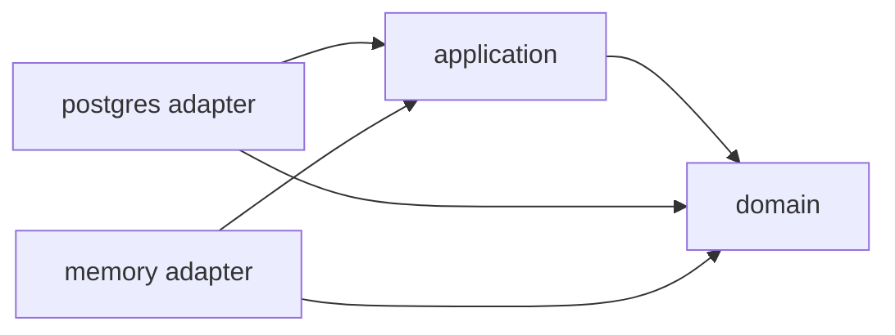

# Repository Pattern trong Go: từ collection abstraction đến production boundary

Repository thường bị dạy như một lớp bọc quanh SQL. Cách hiểu đó tạo thêm file và interface nhưng không làm hệ thống dễ thay đổi hơn. Chương này dùng mini-banking để trả lời câu hỏi khó hơn: application cần nhìn persistence qua một contract nào để vừa bảo vệ domain model, vừa không che giấu những sự thật quan trọng như transaction, locking và query cost?

## Kết quả học tập

Sau chương này, bạn có thể:

- phân biệt Repository với DAO, table gateway và query service;
- đặt interface ở phía consumer thay vì theo thói quen `repository/` toàn cục;
- thiết kế contract theo Aggregate và use case;
- map database row sang domain object mà không làm lộ invalid state;
- quyết định khi nào dùng `Save`, `Update`, `FindForUpdate` hoặc optimistic version;
- viết contract test cho adapter;
- phân tích ownership, transaction, cache và concurrency;
- nhận ra lúc Repository chỉ là ceremony và không nên dùng.

## 1. Problem: bọc SQL chưa tạo ra boundary

Một service ban đầu có thể viết trực tiếp:

```go
func (s *Service) Transfer(ctx context.Context, fromID, toID string, amount int64) error {
	from, err := s.db.QueryRowContext(ctx,
		`SELECT id, balance FROM accounts WHERE id = $1`, fromID,
	)
	// scan, validate, update...
	return err
}
```

Code ngắn, nhưng application đang biết đồng thời:

- schema và tên cột;
- SQL dialect;
- cách biểu diễn tiền trong database;
- thứ tự update;
- business rule rút tiền;
- error của driver.

Nếu chỉ chuyển SQL sang `AccountRepositoryImpl`, business rule vẫn có thể tiếp tục nằm trong adapter. Ta đã di chuyển code chứ chưa tạo ranh giới sở hữu.

Chuỗi coupling cần nhìn thấy:

```text
application import pgx
        ↓
use case biết query và row shape
        ↓
schema migration làm application thay đổi
        ↓
domain object dễ bị biến thành database record
        ↓
unit test phải dựng persistence detail
```

Repository hữu ích khi nó đảo chiều compile-time dependency và nói bằng ngôn ngữ mà consumer cần.

## 2. Ba level để hiểu Repository

### Level 1: trực giác

Hãy hình dung Repository như một collection các Aggregate đã tồn tại:

```go
account, err := accounts.FindByID(ctx, id)
err = accounts.Save(ctx, account)
```

Application hỏi lấy `Account`, gọi behavior của `Account`, rồi lưu trạng thái mới. Nó không hỏi một table có bao nhiêu cột và không tự ghép domain object từ row rời rạc.

Mental model này không có nghĩa dữ liệu thật luôn ở memory. Adapter có thể dùng PostgreSQL, DynamoDB hoặc API khác. Nó có nghĩa contract phục vụ model của consumer.

### Level 2: góc nhìn Backend Engineer

Repository là nơi xử lý các chi tiết persistence như:

- SQL và query parameter;
- scan nullable column;
- mapping row sang Aggregate;
- phân loại `not found`, conflict và lỗi hạ tầng;
- truyền `context.Context` xuống driver;
- chọn connection hoặc transaction hiện tại;
- locking/version khi contract yêu cầu;
- metrics cho query ở adapter boundary.

Nó không nên quyết định `amount` có hợp lệ hay tài khoản frozen có được rút tiền hay không. Đó là domain behavior.

### Level 3: góc nhìn Architecture và Domain Modeling

Repository thường bám theo Aggregate boundary vì Aggregate là consistency boundary. Một lần load cần tạo ra trạng thái domain hợp lệ; một lần save cần bảo toàn Aggregate như một đơn vị.

Điều này dẫn đến ba hệ quả:

1. Repository không nhất thiết tương ứng một table.
2. Một query màn hình không nhất thiết đi qua Aggregate repository.
3. Transaction của use case có thể bao trùm nhiều Repository.

Repository là một abstraction có cost. Nó đáng giá khi bảo vệ language, invariants hoặc khả năng test/thay đổi. Nó không phải huy hiệu để project được gọi là Clean Architecture.

## 3. Repository không phải DAO

DAO thường phản chiếu storage operation:

```go
type AccountDAO interface {
	Insert(ctx context.Context, row AccountRow) error
	Update(ctx context.Context, row AccountRow) error
	Delete(ctx context.Context, id string) error
	SelectByID(ctx context.Context, id string) (AccountRow, error)
}
```

Một consumer-facing Repository có thể nhỏ hơn:

```go
type AccountRepository interface {
	FindByID(ctx context.Context, id domain.AccountID) (*domain.Account, error)
	Save(ctx context.Context, account *domain.Account) error
}
```

Khác biệt không nằm ở tên:

| Khía cạnh | DAO / table gateway | Aggregate Repository |
|---|---|---|
| Model trả về | row/persistence model | domain Aggregate |
| Ngôn ngữ | table và CRUD | nhu cầu của consumer/domain |
| Granularity | record | consistency boundary |
| Invariant | thường không biết | rehydrate Aggregate hợp lệ |
| Query projection | tự nhiên | thường tách read port |

DAO không xấu. Reporting, ETL, admin CRUD hoặc service không có domain behavior có thể dùng DAO trực tiếp và rõ hơn.

## 4. Interface thuộc về ai?

Trong mini-banking, use case định nghĩa đúng điều nó tiêu thụ:

```go
// internal/account/application/ports.go
type AccountRepository interface {
	FindByID(context.Context, domain.AccountID) (*domain.Account, error)
	Save(context.Context, *domain.Account) error
}
```

Adapter PostgreSQL hoặc memory import package application và implement contract. Compile-time dependency là:



Runtime call vẫn đi từ application tới object adapter được inject:

```text
TransferMoney.Execute
        ↓ interface call
PostgresRepository.FindByID
```

Hai hướng này không mâu thuẫn. Dependency Inversion nói về source-code dependency, không nói mọi runtime call phải quay vào trong.

### Khi interface có thể nằm ở domain

Nếu abstraction thực sự là domain concept và nhiều application service cùng dùng một vocabulary ổn định, đặt interface cạnh domain có thể hợp lý. Ví dụ `ExchangeRate` nếu business rule phải quy đổi tiền và nguồn rate là detail bên ngoài.

Hãy hỏi:

- Ai cần contract này?
- Method được đặt tên theo domain hay theo một use case cụ thể?
- Package nào nên có quyền thay đổi contract?

Không dùng quy tắc tuyệt đối “mọi interface phải ở application”. Consumer ownership là một heuristic, không phải luật ngôn ngữ.

## 5. Thiết kế contract từ use case

Use case Transfer cần:

1. tìm tài khoản nguồn;
2. tìm tài khoản đích;
3. lưu hai Aggregate trong cùng transaction.

Contract tối thiểu ở thời điểm này là:

```go
type AccountRepository interface {
	FindByID(ctx context.Context, id domain.AccountID) (*domain.Account, error)
	Save(ctx context.Context, account *domain.Account) error
}
```

Không thêm `List`, `Delete`, `Count`, `FindByEmail` để “sau này có thể cần”. Interface lớn khiến mỗi fake và adapter phải implement behavior không liên quan.

### `Save` hay `Create` + `Update`?

`Save` gần collection mental model, nhưng có thể che giấu semantics:

- insert hay update?
- optimistic version được check không?
- zero rows affected có phải conflict không?
- domain event có được persist cùng không?

Với hệ thống cần hành vi khác biệt rõ, contract sau có thể tốt hơn:

```go
type AccountWriter interface {
	Create(ctx context.Context, account *domain.Account) error
	Update(ctx context.Context, account *domain.Account, expectedVersion uint64) error
}
```

Tên method cần thể hiện guarantee mà caller dựa vào. Đừng chọn `Save` chỉ vì ngắn.

### `FindForUpdate` có nên nằm trong port?

Một lựa chọn:

```go
type AccountRepository interface {
	FindByIDForUpdate(ctx context.Context, id domain.AccountID) (*domain.Account, error)
}
```

Ưu điểm: semantics lock rõ. Nhược điểm: persistence concern xuất hiện trong application vocabulary và implementation memory khó có nghĩa tương đương.

Lựa chọn khác là Transactor tạo context transaction và PostgreSQL adapter luôn dùng `SELECT ... FOR UPDATE` trong use case này. Hoặc dùng optimistic concurrency với version. Quyết định phụ thuộc contention và consistency, không phụ thuộc vẻ đẹp folder.

## 6. Mapping: ba model không phải lúc nào cũng cần

Ví dụ persistence model:

```go
type accountRow struct {
	ID             string
	BalanceMinor   int64
	Currency       string
	OverdraftMinor int64
	Status         string
	Version        uint64
	CreatedAt      time.Time
}
```

Nó map sang `domain.Account` qua một rehydration factory:

```go
func (r accountRow) toDomain() (*domain.Account, error) {
	balance, err := domain.NewMoney(r.BalanceMinor, domain.Currency(r.Currency))
	if err != nil {
		return nil, fmt.Errorf("map balance: %w", err)
	}

	overdraft, err := domain.NewMoney(r.OverdraftMinor, domain.Currency(r.Currency))
	if err != nil {
		return nil, fmt.Errorf("map overdraft: %w", err)
	}

	account, err := domain.RehydrateAccount(
		domain.AccountID(r.ID), balance, overdraft, domain.AccountStatus(r.Status),
	)
	if err != nil {
		return nil, fmt.Errorf("rehydrate account %q: %w", r.ID, err)
	}
	return account, nil
}
```

`RehydrateAccount` vẫn kiểm tra invariant. Database là input không đáng tin tuyệt đối: migration lỗi, manual update hoặc version cũ đều có thể tạo dữ liệu domain không hợp lệ.

### Có phải luôn cần Request DTO + Domain + Row?

Không. Tách ba struct tạo mapping cost, boilerplate và nguy cơ quên field. Reuse hợp lý khi:

- CRUD nhỏ, shape ổn định;
- struct không mang behavior hoặc invariant đáng kể;
- transport/storage thay đổi cùng nhịp;
- coupling đó được chấp nhận có chủ đích.

Tách model đáng giá khi:

- API field và database column tiến hóa độc lập;
- domain giữ private fields và behavior;
- nullability/storage encoding không phải domain concept;
- cần chống mass assignment hoặc lộ dữ liệu;
- một Aggregate trải trên nhiều table.

Architecture tốt không tối đa hóa số mapper; nó đặt mapping ở nơi hai model thật sự khác nhau.

## 7. Error semantics

Không trả thẳng `pgx.ErrNoRows` lên application. Nếu application cần phân nhánh, port phải có semantics ổn định:

```go
var ErrAccountNotFound = errors.New("account not found")

func (r *Repository) FindByID(ctx context.Context, id domain.AccountID) (*domain.Account, error) {
	row := r.querier(ctx).QueryRow(ctx, query, id.String())
	account, err := scanAccount(row)
	if errors.Is(err, pgx.ErrNoRows) {
		return nil, ErrAccountNotFound
	}
	if err != nil {
		return nil, fmt.Errorf("find account %q: %w", id, err)
	}
	return account, nil
}
```

Cần thống nhất nơi sở hữu `ErrAccountNotFound`. Nếu error là semantics của port, nó thường nằm cùng port. Nếu `AccountNotFound` là kết quả business có ý nghĩa xuyên use case, một typed application error có thể phù hợp hơn.

Không map thành HTTP 404 trong Repository. HTTP là quyết định của transport adapter.

### Ma trận lỗi

| Tình huống | Adapter trả về | Application làm gì |
|---|---|---|
| Không có row | stable not-found error | map sang use-case result/error |
| Context hết hạn | wrapped `context.DeadlineExceeded` | dừng, rollback |
| Unique violation | conflict semantic nếu caller cần | không retry mù |
| Serialization failure | retryable infrastructure error | retry transaction có giới hạn |
| Mapping phá invariant | wrapped mapping/corrupt-data error | alert, không tạo object giả |
| Database down | wrapped infrastructure error | rollback, telemetry, policy ở outer layer |

## 8. Memory adapter và ownership

Code chạy được nằm tại [repository.go](../examples/mini-banking/internal/account/infrastructure/memory/repository.go) và [repository_test.go](../examples/mini-banking/internal/account/infrastructure/memory/repository_test.go).

Một bug tinh vi trong fake/in-memory repository:

```go
func (r *Repository) FindByID(_ context.Context, id domain.AccountID) (*domain.Account, error) {
	return r.accounts[id], nil // alias cùng pointer trong store
}
```

Caller gọi `Withdraw`, object trong store đã đổi trước cả `Save`. Test có thể pass dù production transaction rollback. Adapter memory đang cung cấp guarantee khác PostgreSQL.

Giải pháp hiện tại clone Aggregate khi đọc và lưu:

```go
func clone(account *domain.Account) (*domain.Account, error) {
	return domain.RehydrateAccount(
		account.ID(),
		account.Balance(),
		account.OverdraftLimit(),
		account.Status(),
	)
}
```

Ownership rule:

- Repository sở hữu bản trong store.
- Caller sở hữu object được trả về.
- `Save` không giữ pointer mà caller còn có thể mutate.

Đây không chỉ là race prevention; nó làm transaction semantics trong test ít sai lệch hơn. Memory adapter hiện dùng `NoopTransactor`, nên nó vẫn không mô phỏng rollback. Tên và documentation phải nói thật guarantee đó.

## 9. Repository và transaction

Sai lầm thường gặp là mỗi Repository tự mở transaction:

```go
func (r *Repository) Save(ctx context.Context, account *domain.Account) error {
	tx, _ := r.pool.Begin(ctx)
	defer tx.Rollback(ctx)
	// UPDATE one account
	return tx.Commit(ctx)
}
```

Transfer cần debit A và credit B atomic. Hai lời gọi `Save` tự commit không thể biết operation lớn hơn:

```text
Save(A) commit thành công
Save(B) thất bại
```

Transaction boundary thuộc use case vì use case biết toàn bộ atomic business operation:

```go
return tx.WithinTransaction(ctx, func(txCtx context.Context) error {
	from, err := accounts.FindByID(txCtx, cmd.From)
	// load to, execute domain behavior, save both
	return err
})
```

PostgreSQL adapter đọc transaction handle từ `txCtx`, hoặc một thiết kế khác truyền explicit tx-bound repositories vào closure. Chương [11 Transaction Management](../11-transaction-management/README.md) so sánh đầy đủ các lựa chọn.

### Nhược điểm của context-based transaction

- transaction dependency bị ẩn trong context;
- gọi nhầm `context.Background()` làm query thoát transaction;
- key collision hoặc wrong value type chỉ phát hiện runtime;
- method signature không nói nó cần transaction;
- nested transaction cần policy rõ.

Ưu điểm là port không import `pgx.Tx`, nhiều repository có thể cùng tham gia mà application không biết concrete transaction type. Đây là trade-off, không phải đáp án duy nhất.

## 10. Concurrency: Repository contract phải nói về conflict

Hai request cùng đọc balance 1.000.000, cùng rút 800.000. Cả hai domain object đều hợp lệ ở snapshot riêng. Nếu cả hai update thành 200.000, hệ thống mất một lần rút.

### Pessimistic locking

```sql
SELECT id, balance_minor, currency, overdraft_minor, status, version
FROM accounts
WHERE id = $1
FOR UPDATE;
```

Row lock giữ đến cuối transaction. Nó đơn giản cho hot consistency nhưng tăng wait time và deadlock risk. Khi lock hai account, luôn dùng thứ tự ID ổn định để giảm deadlock.

### Optimistic concurrency

```sql
UPDATE accounts
SET balance_minor = $1, version = version + 1
WHERE id = $2 AND version = $3;
```

Nếu `RowsAffected() == 0`, trả `ErrConcurrentModification`. Application có thể retry toàn transaction với budget và jitter. Không retry vô hạn, và request bên ngoài vẫn cần idempotency.

Version là một phần của persistence coordination. Có thể giữ nó trong Aggregate metadata hoặc port-specific snapshot. Chọn cách nào cũng phải tránh để caller vô tình bỏ qua expected version.

## 11. Query side không cần giả làm Aggregate Repository

Endpoint transaction history cần join, pagination và projection:

```go
type TransactionHistory interface {
	ListByAccount(
		ctx context.Context,
		id domain.AccountID,
		page Page,
	) ([]TransactionItem, NextCursor, error)
}
```

`TransactionItem` có thể là application read model. Không cần rehydrate hàng trăm Aggregate chỉ để render JSON. Read port được tối ưu theo query; write Repository bảo vệ behavior và invariant.

Đây là CQRS ở mức nhẹ: tách model đọc/ghi vì nhu cầu khác nhau, không đồng nghĩa phải có Kafka hay hai database.

## 12. Cache đặt ở đâu?

Repository decorator là một lựa chọn:

```go
type CachedAccountRepository struct {
	next  application.AccountRepository
	cache AccountCache
}

func (r *CachedAccountRepository) FindByID(ctx context.Context, id domain.AccountID) (*domain.Account, error) {
	if account, ok := r.cache.Get(ctx, id); ok {
		return account, nil
	}
	account, err := r.next.FindByID(ctx, id)
	if err != nil {
		return nil, err
	}
	r.cache.Set(ctx, account)
	return account, nil
}
```

Nhưng write invalidation, transaction visibility và stale data làm decorator không còn trong suốt. Với balance, cache stale có thể gây quyết định sai hoặc chỉ tạo thêm conflict. Query/read model thường là ứng viên cache an toàn hơn Aggregate đang được ghi liên tục.

Xem thêm [15 Redis Cache](../15-redis-cache/README.md).

## 13. Testing strategy

### 13.1 Use-case test dùng fake của port

Use-case test xác minh behavior mà không cần PostgreSQL:

- load đúng ID;
- domain reject thì không save;
- hai account được save trong transaction context;
- repository error được wrap/propagate;
- transaction error không bị nuốt.

Code chạy được: [transfer_money_test.go](../examples/mini-banking/internal/account/application/transfer_money_test.go).

Fake không chứng minh SQL đúng. Nó chỉ chứng minh application orchestration dựa trên contract.

### 13.2 Contract test

Cùng một test suite có thể áp lên memory và PostgreSQL adapter:

```go
type RepositoryFactory func(t *testing.T) application.AccountRepository

func AccountRepositoryContract(t *testing.T, newRepo RepositoryFactory) {
	t.Run("round trip preserves aggregate", func(t *testing.T) {
		repo := newRepo(t)
		// create aggregate, save, load, compare observable state
	})

	t.Run("missing account has stable semantics", func(t *testing.T) {
		// assert errors.Is(err, application.ErrAccountNotFound)
	})
}
```

Contract test giúp adapter cùng giữ một tập guarantee. Nhưng chỉ suite PostgreSQL thật mới kiểm chứng schema, SQL, constraint, isolation và locking.

### 13.3 Integration test với PostgreSQL thật

Không dùng mock SQL driver để kết luận query production chạy đúng. Integration test cần kiểm tra:

- migration chạy từ database rỗng;
- round-trip mapping, gồm status/currency/version;
- unique và check constraints;
- commit và rollback;
- concurrent update hoặc row lock;
- deadline/cancellation;
- query plan cho hot path khi dữ liệu đủ lớn.

Testcontainers thuận tiện ở local/CI; một PostgreSQL service cố định trong CI cũng hợp lý nếu isolation schema/database được quản lý chặt.

## 14. Wrong và correct

### Wrong: generic God Repository

```go
type Repository[T any] interface {
	Find(context.Context, map[string]any) ([]T, error)
	Create(context.Context, T) error
	Update(context.Context, map[string]any, map[string]any) error
	Delete(context.Context, map[string]any) error
}
```

Nó xóa domain language, làm type safety yếu và kéo query DSL vào application. Generic không tự động tạo reuse có giá trị.

### Wrong: port trả persistence model

```go
type AccountRepository interface {
	FindByID(context.Context, string) (postgres.AccountRow, error)
}
```

Application buộc import adapter hoặc package row trung tâm. Dependency direction đã hỏng dù method có tên `Repository`.

### Wrong: business rule trong SQL adapter

```go
func (r *Repository) Withdraw(ctx context.Context, id string, amount int64) error {
	_, err := r.db.ExecContext(ctx,
		`UPDATE accounts SET balance = balance - $1
		 WHERE id = $2 AND balance - $1 >= -overdraft_limit`, amount, id)
	return err
}
```

Atomic SQL có thể hữu ích vì concurrency, nhưng nếu đây là rule cốt lõi duy nhất được giấu trong SQL thì domain test không còn kiểm chứng rule. Có thể chủ đích dùng database-centric model, nhưng phải thừa nhận architecture đã chọn và bổ sung integration test mạnh.

### Correct trong context mini-banking

```text
HTTP DTO -> TransferCommand
             ↓
      TransferMoney use case
        ↓             ↓
AccountRepository  Transactor       (ports)
        ↑             ↑
 PostgresRepository  PGTransactor   (adapters)
```

Application orchestration; Account giữ invariant; adapter giữ persistence detail; composition root chọn implementation.

## 15. Production scenario: 5.000 TPS và hot account

Giả sử tài khoản merchant nhận hàng nghìn transfer mỗi giây:

1. `SELECT FOR UPDATE` biến merchant row thành điểm serialize.
2. Request queue sau lock có thể vượt HTTP deadline.
3. Context hủy phải làm query/transaction dừng và connection quay lại pool.
4. Retry serialization/deadlock tăng tải nếu không có backoff.
5. Response mất sau commit khiến client retry, nên idempotency không thể chỉ nằm trong memory.
6. Replica lag khiến read-after-write history chưa thấy transfer.

Boundary xử lý:

| Concern | Boundary phù hợp |
|---|---|
| amount, currency, overdraft | Domain |
| atomic transfer, retry budget | Application/transaction policy |
| row lock, version, SQL error mapping | PostgreSQL adapter |
| idempotency key lifecycle | Application + durable store |
| HTTP timeout/status | Delivery adapter |
| lock wait/query metrics | Infrastructure instrumentation |

Repository không giải quyết toàn bộ scenario; nó làm rõ nơi các quyết định được cắm vào.

## 16. Failure investigation

### Triệu chứng: balance đổi dù use case trả lỗi

Kiểm tra:

1. Memory repository có trả cùng pointer đang lưu không?
2. Hai `Save` có cùng transaction handle không?
3. Có code dùng `context.Background()` trong closure không?
4. Error từ `Commit` có bị bỏ qua không?
5. Retry có chạy lại mutation trên cùng Aggregate instance không?

### Triệu chứng: thỉnh thoảng mất update

Thu thập:

- transaction isolation thực tế;
- SQL update có expected version không;
- lock query và thứ tự lock;
- số row affected;
- trace ID, account ID đã hash/redact;
- deadlock/serialization metrics;
- application retry count.

Đừng sửa bằng mutex trong một process nếu service có nhiều replica. Mutex đó không bảo vệ truy cập từ process khác.

### Triệu chứng: pool cạn

Tìm transaction mở lâu, row lock wait, network call trong closure, loop query N+1 và code không close rows. Repository metrics cần phân biệt thời gian chờ connection với thời gian query.

## 17. Khi nào không nên dùng Repository?

Không nhất thiết tạo Aggregate Repository nếu:

- service là tiny CRUD với vài endpoint và model không có behavior;
- read-only reporting/query service;
- ETL hoặc batch pipeline làm việc chủ yếu với row;
- code ngắn hạn, một storage ổn định và test qua integration đủ rẻ;
- abstraction chỉ copy nguyên API của ORM/driver.

Một cấu trúc `handler -> store` với interface nhỏ vẫn có thể sạch hơn `controller -> service -> usecase -> repository -> DAO` mà mỗi lớp chỉ forward arguments.

Hãy thêm boundary khi có volatility, policy, testing seam hoặc ownership thật sự cần bảo vệ.

## 18. Bài thực hành

Làm [Lab 03: Repository](../labs/lab-03-repository/README.md), sau đó mở rộng:

1. Thêm optimistic `Version` và `ErrConcurrentModification`.
2. Viết contract suite chạy cho memory adapter.
3. Tạo PostgreSQL adapter và chạy cùng contract suite bằng Testcontainers.
4. Cố tình trả pointer alias từ memory store, viết test bắt lỗi trước khi sửa.
5. Thiết kế read port cho transaction history mà không rehydrate Aggregate.

## 19. Câu hỏi mastery

1. Vì sao interface cùng tên và method vẫn có thể không tạo Dependency Inversion?
2. Repository khác DAO ở model, language và consistency boundary thế nào?
3. Vì sao một Repository tự commit từng `Save` không đủ cho Transfer?
4. Khi nào `FindForUpdate` là contract rõ ràng, khi nào nó làm lộ persistence detail quá mức?
5. Vì sao fake repository trả pointer alias có thể làm test nói dối?
6. `Save` che giấu những semantics nào?
7. Tại sao query history có thể dùng read model trực tiếp?
8. Nếu application import `pgx.ErrNoRows`, ownership nào đã bị đảo?
9. Optimistic concurrency khác idempotency ở điểm nào?
10. Với CRUD nhỏ, chi phí Repository có được hoàn lại không?

## 20. Further reading

- Eric Evans, *Domain-Driven Design*, phần Repositories và Aggregates.
- Martin Fowler, *Patterns of Enterprise Application Architecture*, Repository và Data Mapper.
- Alistair Cockburn, Ports and Adapters.
- Go documentation: `context`, `database/sql` và error wrapping.
- PostgreSQL documentation: explicit locking, transaction isolation và serialization failures.

Các nguồn mô tả nhiều phong cách khác nhau. Fowler's Repository, DDD Repository và một interface store idiomatic Go có phần giao nhau nhưng không đồng nhất; hãy chọn theo model và guarantee cần giữ.

## Quality gate

- [x] Problem và mental model
- [x] Ba level giải thích
- [x] Go implementation và dependency analysis
- [x] Wrong/correct examples
- [x] Mapping, errors, transaction và concurrency
- [x] Runtime/compile-time dependency
- [x] Trade-off và khi không nên dùng
- [x] Production/failure/debug scenarios
- [x] Testing strategy và executable example links
- [x] Exercises, mastery questions và references

Chương tiếp theo nên đọc: [08 Dependency Injection](../08-dependency-injection/README.md). Trước đó, [06 Delivery Layer](../06-delivery-layer/README.md) và [07 Infrastructure Layer](../07-infrastructure-layer/README.md) giúp đặt hai adapter side vào đúng vai trò.
