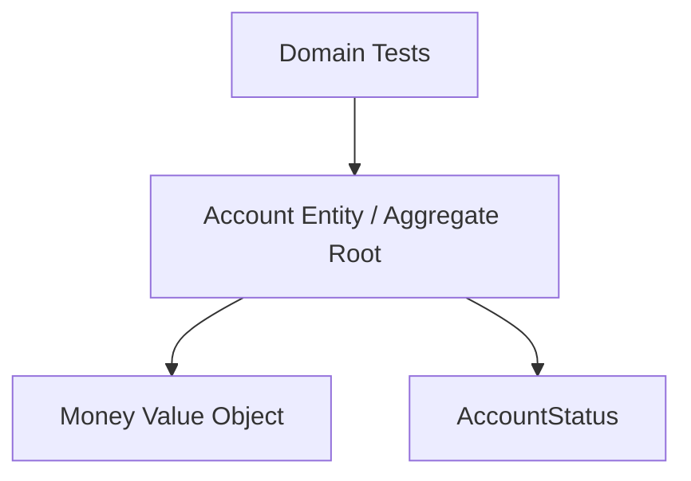

# Lab 01: Simple Domain

Thời lượng gợi ý: 60-90 phút.

## Mục Tiêu

Refactor một Account anemic thành domain model bảo vệ valid state.

Sau lab, bạn phải giải thích được:

- Vì sao private field chỉ là mechanism, invariant mới là mục tiêu.
- Vì sao `Money` phù hợp Value Object còn `Account` là Entity.
- Tại sao constructor và rehydration cũng phải validate.
- Tại sao rejected operation không được mutate state.
- Domain test chứng minh gì và không chứng minh gì.

## Kiến Thức Cần

- Struct, named type, methods và pointer/value receiver.
- Error handling, `errors.Is`.
- Table-driven tests.
- Đã đọc chapter 03 phần Entity, Value Object và Invariant.

## Architecture Diagram



Lab không có HTTP, repository, database, context, logger hoặc mock.

## Problem

Starter có public fields:

```go
type Account struct {
	ID             string
	Balance        int64
	OverdraftLimit int64
	Currency       string
}
```

Function `Withdraw` có check limit, nhưng bất kỳ caller nào vẫn có thể làm:

```go
account.Balance = -999_999
```

Test `TestPublicBalanceCanBreakInvariant` pass không phải vì code tốt. Nó là executable evidence rằng model cho phép invalid state.

## Domain Rules

```text
AccountID không rỗng.
Currency là ba chữ cái được normalize uppercase.
Balance và overdraftLimit cùng currency.
OverdraftLimit không âm.
Balance >= -overdraftLimit.
Deposit/withdraw amount phải dương.
Frozen account không withdraw.
Frozen account vẫn nhận deposit trong policy của lab.
```

## Yêu Cầu

1. Tạo `Money` với private `amount` và `currency`.
2. Constructor `NewMoney` validate/normalize currency.
3. `Add`, `Sub`, `Negate`, `LessThan`, `Equal` trả value mới hoặc error.
4. Tạo `AccountID` và `AccountStatus` rõ nghĩa.
5. Giữ fields Account private.
6. Constructor Account reject mọi initial state vi phạm invariant.
7. Chỉ đổi balance qua `Withdraw`/`Deposit`.
8. Rejected operation giữ nguyên state.
9. Thêm `Freeze`/`Activate`; frozen withdrawal bị reject.
10. Không import infrastructure/transport package.

## Các Bước

### Bước 1: Chạy Baseline

```bash
cd labs/lab-01-simple-domain/starter
go test ./... -v
```

Đọc vì sao test public balance pass nhưng lại chứng minh design flaw.

### Bước 2: Viết Invariant Matrix

Trước khi refactor, liệt kê:

| State | Operation | Boundary input | Expected |
|---|---|---|---|
| active | withdraw | đúng overdraft boundary | allow |
| active | withdraw | vượt 1 minor unit | reject, unchanged |
| frozen | withdraw | positive | reject, unchanged |
| frozen | deposit | positive | allow |

Thêm zero/negative/currency mismatch/invalid construction.

### Bước 3: Tạo Value Object

Đưa amount + currency vào `Money`. Không cho Account tự cộng primitive và quên currency check.

### Bước 4: Đóng Mutation Paths

Private fields và behavior methods. Không thay public field bằng setters `SetBalance`/`SetStatus`.

### Bước 5: Bảo Vệ Creation

Test initial balance dưới limit và zero-value Money. Constructor phải fail trước khi trả Account.

### Bước 6: Test State Transition

Kiểm cả error và state unchanged. Chạy race detector dù lab không tự spawn goroutine:

```bash
go test -race ./...
```

### Bước 7: So Sánh Solution

Chỉ mở `solution/` sau khi implementation của bạn chạy. So sánh public API và reasoning, không chỉ diff số dòng.

## Expected Behavior

```text
balance 100.000, limit 50.000
withdraw 150.000 -> success, balance -50.000
withdraw 150.001 -> ErrInsufficientBalance, balance unchanged
deposit USD vào VND account -> ErrCurrencyMismatch
withdraw từ frozen -> ErrAccountFrozen
deposit vào frozen -> success
create balance -50.001, limit 50.000 -> ErrInvalidOverdraftRule
```

## Test Matrix Tối Thiểu

- Currency normalization và invalid shape.
- Money equality/immutability.
- Currency mismatch.
- Constructor invalid ID/currency/overdraft/balance/status.
- Withdraw happy path/exact boundary/beyond boundary.
- Deposit/withdraw zero và negative.
- Frozen transitions.
- Rejected operation giữ state unchanged.

## Questions

1. Tại sao `Money` dùng value receiver còn `Account` dùng pointer receiver?
2. Vì sao private field không đủ nếu constructor sai?
3. `AccountID` là Value Object hay Entity?
4. Rule frozen vẫn nhận deposit nằm ở đâu để mọi caller tuân theo?
5. Vì sao không truyền `context.Context` vào `Withdraw`?
6. Test domain pass có ngăn hai request concurrent lost update không?
7. Nếu đây chỉ là CRUD admin không có rule, design nào có thể đơn giản hơn?

## Challenge

Chọn một, không đọc solution vì challenge không có implementation mẫu:

- Thêm checked overflow cho Money arithmetic.
- Thêm `closed` state và transition graph.
- Thêm `ChangeOverdraftLimit` không làm current balance invalid.
- Thêm Domain Event `AccountFrozen` nhưng không import Kafka.

## Solution Explanation

Solution dùng:

- Named types cho identity/status.
- Value Object với immutable-style arithmetic.
- Candidate state rồi mới assign.
- Constructor dùng cùng invariant với transitions.
- Sentinel domain errors cho category hiện tại.
- Tests không mock và không cần external process.

Solution không phải đáp án duy nhất. Một production Money có thể cần decimal/scale/rounding và overflow policy phức tạp hơn.

## Hoàn Thành Lab Khi

- [ ] `go test -race ./...` pass trong implementation của bạn.
- [ ] Không code ngoài package gán balance/status trực tiếp.
- [ ] Constructor không trả invalid Account.
- [ ] Error path không mutate state.
- [ ] Bạn trả lời được domain guarantee và system guarantee khác nhau thế nào.
