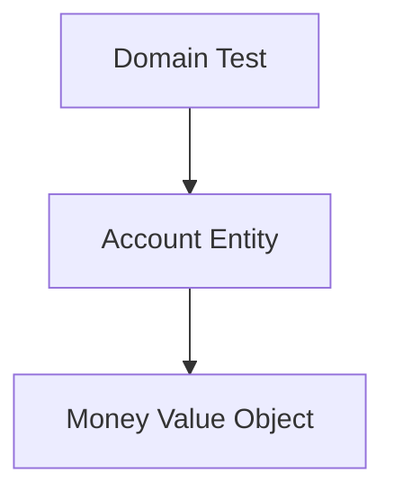

# Lab 01: Simple Domain

## Mục tiêu

Tạo domain model nhỏ cho banking account và đặt business rule đúng chỗ.

Sau lab này, bạn phải hiểu:

- Vì sao không nên sửa `Balance` trực tiếp từ use case hoặc handler.
- Vì sao domain test không cần mock, database hoặc HTTP.
- Khi nào Value Object như `Money` đáng để tách riêng.

## Kiến thức cần biết

- Struct và method trong Go.
- Error handling.
- Table-driven test cơ bản.
- Khác biệt giữa Entity và DTO.

## Yêu cầu

Thiết kế:

```text
Account
Money
Withdraw
Deposit
```

Invariant:

```text
Balance sau khi withdraw không được nhỏ hơn -OverdraftLimit.
Amount dùng để deposit/withdraw phải lớn hơn 0.
Không được cộng trừ hai Money khác currency.
```

## Sơ đồ



Không có HTTP, database, repository, Kafka trong lab này.

## Các bước

1. Tạo `Money` với amount và currency.
2. Tạo method `Add`, `Sub`, `Negate`, `LessThan`.
3. Tạo `Account` với private fields.
4. Tạo method `Withdraw` và `Deposit`.
5. Viết test cho insufficient balance, overdraft limit và currency mismatch.

## Câu hỏi

1. Nếu field `Balance` public, invariant nào có thể bị phá?
2. Vì sao `Withdraw` thuộc domain entity thay vì HTTP handler?
3. `Money` là Entity hay Value Object?
4. Nếu hệ thống chỉ CRUD không có rule tiền tệ, tách `Money` có thể là over-engineering không?

## Challenge

Thêm rule:

```text
Một tài khoản bị frozen thì không được withdraw.
```

Bạn sẽ thêm field và method nào để vẫn giữ invariant trong domain?

## Solution explanation

Xem `solution/README.md` sau khi tự làm. Solution ưu tiên domain behavior hơn setter, dùng error domain-level và không import bất kỳ package infrastructure nào.
